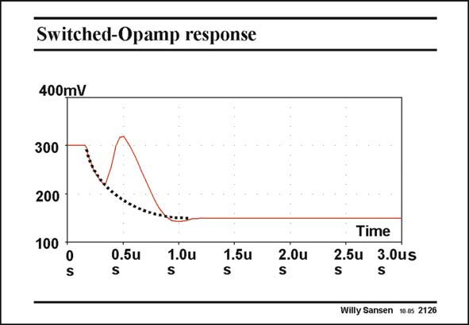

# SANSEN-2126 · Switched-Opamp response

章节：21 低功耗 ΣΔ 模数转换器  
PDF 页：639；书本页：650；幻灯片编号：2126  
状态：unreviewed



## 对应教材讲解

### PDF 639 · 书本 650

This is the output voltage of the switched opamp of the previous slide, when it is switched out. The expected exponential is given by the dotted line. The time constant is indeed one over two times p times the bandwidth of the opamp. A big hump occurs however, after about 0.5 ms. This is a result of the discharge of the compensation capacitance C . It is a great deal c better to insert a switch in series with this capacitor, not to allow it to discharge and charge, as will be shown later.

## 公式／性能结论候选摘录

以下为规则截取的原文，尚未逐项判读。

- PDF 639: The time constant is indeed one over two times p times the bandwidth of the opamp.

## 曲线结论候选摘录

以下为规则截取的原文，尚未逐项判读。

（未由规则找到；不代表原页没有此类内容。）

## 原文条件与近似候选摘录

以下为规则截取的原文，尚未逐项判读。

（未由规则找到；不代表原页没有此类内容。）

## 幻灯片 OCR（未校正）

```text
Switched-Opamp response
400mV
300
200
100
0
S
S.5u
1.0u
1.5u
z.0u
Time
2.5u 3.0us
S
Willy Sansen
10.05 2126
```

数学上下标、分数及正负号以原图为准。电路图已保留；未核对的连接不输出成可仿真 netlist。
