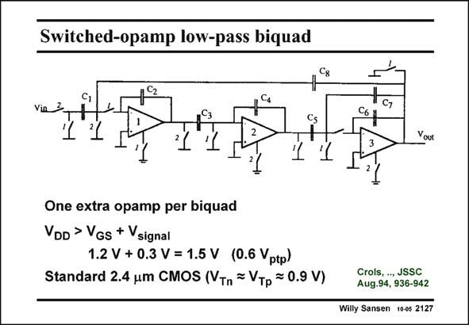

# SANSEN-2127 · Switched-opamp low-pass biquad

章节：21 低功耗 ΣΔ 模数转换器  
PDF 页：640；书本页：651；幻灯片编号：2127  
状态：unreviewed



## 对应教材讲解

### PDF 640 · 书本 651

A low-pass biquadratic filter using this technique, is shown in this slide. Each opamp is switched according to the switch of the next sampling capacitor. An extra switched opamp is added to provide the feedback on phase 2.The minimum supply voltages for this realization is about 1.5 V. In this older CMOS technology the V is about T 0.9 V and the V is 1.2 V GS (for V −V #0.3 V). For GS T an input voltage of 0.6 V , ptp the minimum supply voltage is about 1.5 V. The input switch on phase 2 is the main problem. It limits the input range to V minus V DD T or about 0.6 V.

## 公式／性能结论候选摘录

以下为规则截取的原文，尚未逐项判读。

- PDF 640: It limits the input range to V minus V DD T or about 0.6 V.

## 曲线结论候选摘录

以下为规则截取的原文，尚未逐项判读。

- PDF 640: An extra switched opamp is added to provide the feedback on phase 2.The minimum supply voltages for this realization is about 1.5 V.
- PDF 640: The input switch on phase 2 is the main problem.

## 原文条件与近似候选摘录

以下为规则截取的原文，尚未逐项判读。

（未由规则找到；不代表原页没有此类内容。）

## 幻灯片 OCR（未校正）

```text
Switched-opamp low-pass biquad
C,
Via 3.
Cs
1
+
C7
cор
3
Your
One extra opamp per biquad
VoD > VGs + Vsignal
1.2 V + 0.3 V = 1.5 V (0.6 Vptp)
Standard 2.4 um CMOS (VTn = Vтp = 0.9 V)
Crols, .., JSSC
Aug.94, 936-942
Willy Sansen 10-0s 2127
```

数学上下标、分数及正负号以原图为准。电路图已保留；未核对的连接不输出成可仿真 netlist。
