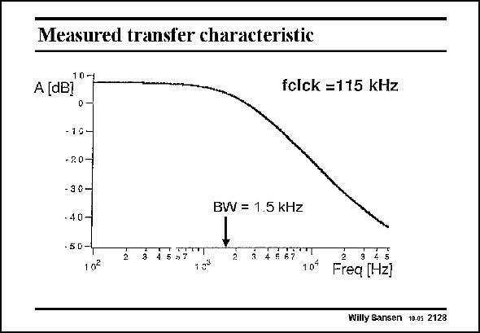

# SANSEN-2128 · Measured transfer characteristic

章节：21 低功耗 ΣΔ 模数转换器  
PDF 页：640；书本页：651；幻灯片编号：2128  
状态：unreviewed



## 对应教材讲解

### PDF 640 · 书本 651

The low-pass filter characteristic is as expected. It shows a −40 dB/decade roll-off for frequencies beyond the bandwidth (which is 1.5 kHz), up to about half the clock frequency of 115 kHz. At low frequencies the gain is a factor of 2 or 6 dB. Let us observe the noise and distortion.

## 公式／性能结论候选摘录

以下为规则截取的原文，尚未逐项判读。

- PDF 640: It shows a −40 dB/decade roll-off for frequencies beyond the bandwidth (which is 1.5 kHz), up to about half the clock frequency of 115 kHz.
- PDF 640: At low frequencies the gain is a factor of 2 or 6 dB.

## 曲线结论候选摘录

以下为规则截取的原文，尚未逐项判读。

- PDF 640: The low-pass filter characteristic is as expected.
- PDF 640: It shows a −40 dB/decade roll-off for frequencies beyond the bandwidth (which is 1.5 kHz), up to about half the clock frequency of 115 kHz.

## 原文条件与近似候选摘录

以下为规则截取的原文，尚未逐项判读。

（未由规则找到；不代表原页没有此类内容。）

## 幻灯片 OCR（未校正）

```text
Measured transfer characteristic
10-1
A dBl
-10-
-20-
-30-
•40-
• 50-4
10₴
BW = 1.5 kHz
2
4 5 67
10€
fclck =115 kHz
Freq [Hz]
Willy Sansen 10.05 2128
```

数学上下标、分数及正负号以原图为准。电路图已保留；未核对的连接不输出成可仿真 netlist。
