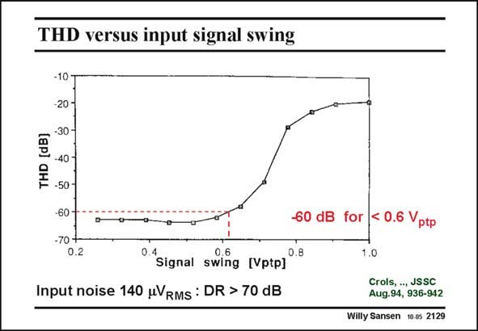

# SANSEN-2129 · THD versus input signal swing

章节：21 低功耗 ΣΔ 模数转换器  
PDF 页：641；书本页：652；幻灯片编号：2129  
状态：unreviewed



## 对应教材讲解

### PDF 640 · 书本 651

The input noise is mainly the kT/C noise, typical for a switched-capacitor filter. It is therefore fairly high. The distortion comes up rather strongly once the input signal has become so large that the input switch cannot be fully switched on any more. This occurs at about 0.6 V input amplitude. ptp The resulting DR is close to 70 dB which is typical for switched-capacitor filters. No additional disadvantages are present as a result of the switched opamp approach.

### PDF 641 · 书本 652

The total power consumption (at this 2.4 mm CMOS technology) is 110 mW at 1.5 V supply voltage. This is quite low. Indeed, an additional advantage of the switchedopamp approach is that the opamps are off 50% of the time. The power consumption is therefore halved as well, which is a considerable advantage. Even more power can be consumed when a class-AB stage is used at the output. This will be shown later.

## 公式／性能结论候选摘录

以下为规则截取的原文，尚未逐项判读。

- PDF 640: It is therefore fairly high.
- PDF 640: No additional disadvantages are present as a result of the switched opamp approach.
- PDF 641: The power consumption is therefore halved as well, which is a considerable advantage.

## 曲线结论候选摘录

以下为规则截取的原文，尚未逐项判读。

（未由规则找到；不代表原页没有此类内容。）

## 原文条件与近似候选摘录

以下为规则截取的原文，尚未逐项判读。

（未由规则找到；不代表原页没有此类内容。）

## 幻灯片 OCR（未校正）

```text
THD versus input signal swing
-10
-20-
=-30-
'-40
F -50-
-60-
-70 +
0.2
60
dB
• Signal swing (Vptp]
0.8
Input noise 140 uVRMS : DR > 70 dB
for < 0.6 Vptp
1.0
Crols, --, JSSC
Aug.94, 936-942
Willy Sansen 10.05 2129
```

数学上下标、分数及正负号以原图为准。电路图已保留；未核对的连接不输出成可仿真 netlist。
