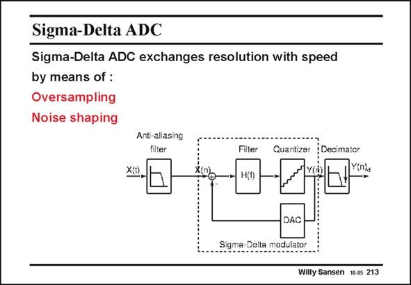

# SANSEN-213 · Sigma-Delta ADC Sigma-Delta ADC exchanges resolution with speed

章节：21 低功耗 ΣΔ 模数转换器  
PDF 页：627；书本页：638；幻灯片编号：213  
状态：unreviewed



## 对应教材讲解

### PDF 627 · 书本 638

A Sigma-Delta Analog-todigital converter samples the incoming analog signal at a frequency, which is much higher than needed. The minimum sampling frequency according to Nyquist, is twice the maximum frequency of the incoming signal. For lowquality speech, the bandwidth is limited to 3.4 kHz. The minimum sampling frequency would be 6.8 kHz. An ECG (Electro Cardio Gram) is limited to about 150 Hz. Its minimum sampling frequency would be 300 Hz. In Sigma-Delta ADCs the sampling frequency is much higher, 20 to 1000 times, depending on the application. The ratio of this sampling frequency to the minimum Nyquist sampling frequency is called the oversampling ratio (OSR). It is the first design parameter in a Sigma-Delta converter. The more the incoming signal is over-sampled, the more the signal information is emphasized with respect to the noise. As a result, the SNR (Signal-to-Noise Ratio) will be higher for an higher oversampling ratio (OSR). The resolution of the ADC will be higher for an higher oversampling ratio (OSR). We can state that the high oversampling leads to higher resolution. A Sigma-Delta ADC exchanges speed for resolution. To effectively obtain this higher SNR however, the noise must be filtered out. This is achieved by noise shaping. This is realized by a filter H(f ). A Sigma-Delta converter consists of a feedback loop with a filter and a quantizer, which carries out the AD Conversion. The feedback loop is closed over a DAC. A prefilter (anti-aliasing filter) is required to make sure the incoming bandwidth is limited. A post filter (decimator filter) is applied to lower the sampling frequency to what satisfies Nyquist.

## 公式／性能结论候选摘录

以下为规则截取的原文，尚未逐项判读。

- PDF 627: For lowquality speech, the bandwidth is limited to 3.4 kHz.
- PDF 627: An ECG (Electro Cardio Gram) is limited to about 150 Hz.
- PDF 627: In Sigma-Delta ADCs the sampling frequency is much higher, 20 to 1000 times, depending on the application.
- PDF 627: As a result, the SNR (Signal-to-Noise Ratio) will be higher for an higher oversampling ratio (OSR).
- PDF 627: A prefilter (anti-aliasing filter) is required to make sure the incoming bandwidth is limited.

## 曲线结论候选摘录

以下为规则截取的原文，尚未逐项判读。

（未由规则找到；不代表原页没有此类内容。）

## 原文条件与近似候选摘录

以下为规则截取的原文，尚未逐项判读。

（未由规则找到；不代表原页没有此类内容。）

## 幻灯片 OCR（未校正）

```text
Sigma-Delta ADC
Sigma-Delta ADC exchanges resolution with speed
by means of :
Oversampling
Noise shaping
Anti-aliasing
filter
Filter
Quantizer
Decimator
vin)
Sigma-
DAC
nodulato:
Willy Sansen 10.05 213
```

数学上下标、分数及正负号以原图为准。电路图已保留；未核对的连接不输出成可仿真 netlist。
