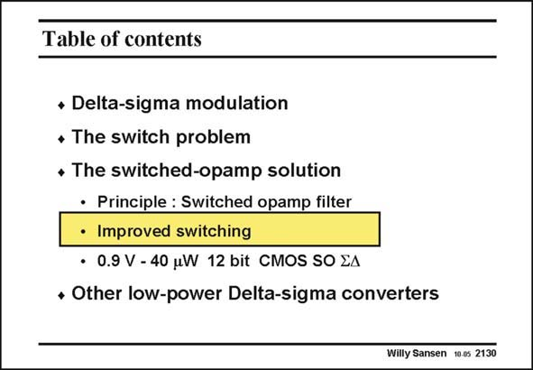

# SANSEN-2130 · Table of contents

章节：21 低功耗 ΣΔ 模数转换器  
PDF 页：641；书本页：652；幻灯片编号：2130  
状态：unreviewed



## 对应教材讲解

### PDF 641 · 书本 652

The input switch is still a problem in the switchedopamp approach discussed before. Improved input switching is now required. Moreover, the switching of the opamp causes transients which are unacceptable. Possible remedies are discussed next.

## 公式／性能结论候选摘录

以下为规则截取的原文，尚未逐项判读。

（未由规则找到；不代表原页没有此类内容。）

## 曲线结论候选摘录

以下为规则截取的原文，尚未逐项判读。

（未由规则找到；不代表原页没有此类内容。）

## 原文条件与近似候选摘录

以下为规则截取的原文，尚未逐项判读。

（未由规则找到；不代表原页没有此类内容。）

## 幻灯片 OCR（未校正）

```text
Table of contents
• Delta-sigma modulation
• The switch problem
• The switched-opamp solution
• Principle : Switched opamp filter
• Improved switching
• 0.9 V - 40 uW 12 bit CMOS SO EA
• Other low-power Delta-sigma converters
Willy Sansen 10.05 2130
```

数学上下标、分数及正负号以原图为准。电路图已保留；未核对的连接不输出成可仿真 netlist。
