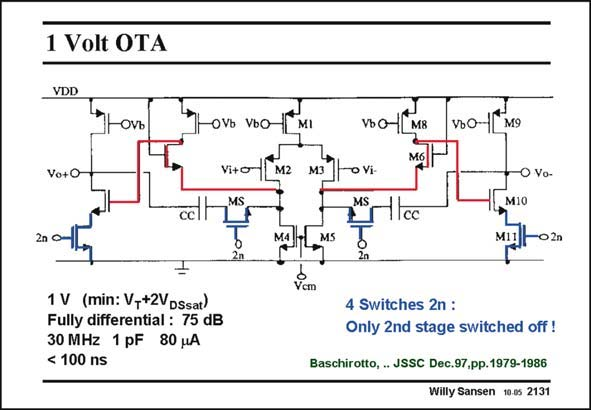

# SANSEN-2131 · 1 Volt OTA

章节：21 低功耗 ΣΔ 模数转换器  
PDF 页：642；书本页：653；幻灯片编号：2131  
状态：unreviewed



## 对应教材讲解

### PDF 641 · 书本 652

The first remedy is to make everything fully differential. A fully-differential opamp is now used, as shown in this slide. It is a two-stage Miller opamp with a folded cascode as a first stage. A second stage is needed to provide rail-to-rail output swing. The gain can be quite high, 75 dB in this example. For a 1 pF load, the GBW is about 30 MHz, for only 80 mW power consumption. This gives a high FOM indeed! The opamp can be switched in and out because of the four switches (in blue). Only the output stage is switched in and out, by transistors M11. The input stage remains on, which improves the settling time.

### PDF 642 · 书本 653

Of more importance, is that the compensation capacitance CC has a series switch MS. The voltage across CC is therefore constant irrespective of the switching. The settling time is greatly improved by this arrangement. The minimum supply voltage V is only DD V +V or V +2 V . GS DSsat T DSsat For a V of 0.6 V, a V of T DD 1 V is easily achieved (V −V =0.2 V). GS T Note that the inputs operate close to ground. As a result the whole supply voltage V is available for V of the input switch V . DD GS GS The average output voltage is about 0.5 V however, for maximum output swing. A level shifter is required between output and input.

## 公式／性能结论候选摘录

以下为规则截取的原文，尚未逐项判读。

- PDF 641: The gain can be quite high, 75 dB in this example.
- PDF 642: The voltage across CC is therefore constant irrespective of the switching.
- PDF 642: As a result the whole supply voltage V is available for V of the input switch V .

## 曲线结论候选摘录

以下为规则截取的原文，尚未逐项判读。

（未由规则找到；不代表原页没有此类内容。）

## 原文条件与近似候选摘录

以下为规则截取的原文，尚未逐项判读。

（未由规则找到；不代表原页没有此类内容。）

## 幻灯片 OCR（未校正）

```text
1 Volt OTA
VDD
OVb
OVь VьO
MI
VONM8
VьО-
M9
Vo+O
Vi+o
M2
ToVi-
• Vo-
Icc
M10
2n •
M11
-02n
1 V (min: V,+2VDSsat)
Fully differential : 75 dB
30 MHz 1 pF 80 uA
< 100 ns
Vcm
4 Switches 2n :
Only 2nd stage switched off !
Baschirotto, JSSC Dec.97,pp.1979-1986
Willy Sansen 10.05 2131
```

数学上下标、分数及正负号以原图为准。电路图已保留；未核对的连接不输出成可仿真 netlist。
