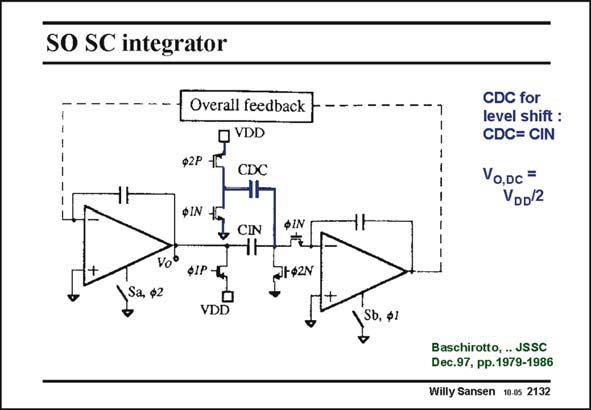

# SANSEN-2132 · SO SC integrator

章节：21 低功耗 ΣΔ 模数转换器  
PDF 页：642；书本页：653；幻灯片编号：2132  
状态：unreviewed



## 对应教材讲解

### PDF 642 · 书本 653

Such a level shifter is implemented by addition of capacitor CDC. This capacitor is taken to be the same as capacitor CIN. The DC output voltage V is now O found to be half the supply voltage V . DD This is explained in more detail next. The circuit is repeated twice, once at phase W1 and once at phase W2.

## 公式／性能结论候选摘录

以下为规则截取的原文，尚未逐项判读。

（未由规则找到；不代表原页没有此类内容。）

## 曲线结论候选摘录

以下为规则截取的原文，尚未逐项判读。

- PDF 642: The circuit is repeated twice, once at phase W1 and once at phase W2.

## 原文条件与近似候选摘录

以下为规则截取的原文，尚未逐项判读。

（未由规则找到；不代表原页没有此类内容。）

## 幻灯片 OCR（未校正）

```text
SO SC integrator
Overall feedback
VDD
$2P
CDC
ФIN
Sa, $2
J CIN
Vo®
ф1P -TC
•
VDD
фIN
St42N
CDC for
level shift :
CDC= CIN
Vo,Dc =
VDD/2
Sb, ф1
Baschirotto, JSSC
Dec.97, pp.1979-1986
Willy Sansen 10.05 2132
```

数学上下标、分数及正负号以原图为准。电路图已保留；未核对的连接不输出成可仿真 netlist。
