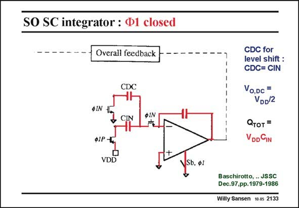

# SANSEN-2133 · SO SC integrator : Ф1 closed

章节：21 低功耗 ΣΔ 模数转换器  
PDF 页：643；书本页：654；幻灯片编号：2133  
状态：unreviewed



## 对应教材讲解

### PDF 643 · 书本 654

Under phase W1, the first opamp is switched off and is therefore left out. Capacitor C finds itself between DC ground and the virtual ground, at the minus input of the opamp. It carries no charge. The total charge at the input is found on capacitor C , which is between IN supply voltage V and the DD virtual ground.

## 公式／性能结论候选摘录

以下为规则截取的原文，尚未逐项判读。

- PDF 643: Under phase W1, the first opamp is switched off and is therefore left out.

## 曲线结论候选摘录

以下为规则截取的原文，尚未逐项判读。

- PDF 643: Under phase W1, the first opamp is switched off and is therefore left out.

## 原文条件与近似候选摘录

以下为规则截取的原文，尚未逐项判读。

（未由规则找到；不代表原页没有此类内容。）

## 幻灯片 OCR（未校正）

```text
SO SC integrator : Ф1 closed
- Overall feedback
CDC
SIN
& CIN
фIN
CDC for
level shift:
CDC= CIN
Vo,Dc =
VDD/2
Отот =
VDD CIN
ФІР -
VDD
VSb. ф1
Baschirotto, ... JSSC
Dec.97,pp.1979-1986
Willy Sansen 10.05 2133
```

数学上下标、分数及正负号以原图为准。电路图已保留；未核对的连接不输出成可仿真 netlist。
