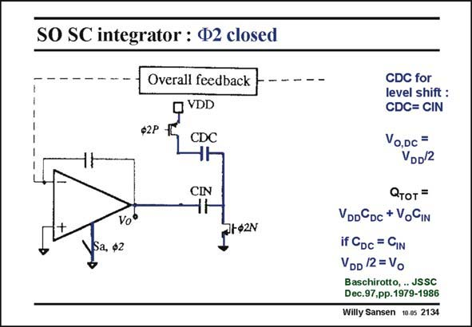

# SANSEN-2134 · SO SC integrator : Ф2 closed

章节：21 低功耗 ΣΔ 模数转换器  
PDF 页：643；书本页：654；幻灯片编号：2134  
状态：unreviewed



## 对应教材讲解

### PDF 643 · 书本 654

Under phase W2, the second opamp is switched off and is therefore left out. Capacitor C now finds itself between DC the supply voltage V and DD ground. Capacitor C now carries IN charge V C . The total O IN charge is therefore found, as given in this slide. If capacitors C and C are made DC IN equal, the DC output voltage V ends up at half the O supply voltage. This sets the output and input common-mode voltages. All switches now have the full supply-voltage V as their V . This is also true for the DD GS input switches.

## 公式／性能结论候选摘录

以下为规则截取的原文，尚未逐项判读。

- PDF 643: Under phase W2, the second opamp is switched off and is therefore left out.
- PDF 643: The total O IN charge is therefore found, as given in this slide.
- PDF 643: If capacitors C and C are made DC IN equal, the DC output voltage V ends up at half the O supply voltage.

## 曲线结论候选摘录

以下为规则截取的原文，尚未逐项判读。

- PDF 643: Under phase W2, the second opamp is switched off and is therefore left out.

## 原文条件与近似候选摘录

以下为规则截取的原文，尚未逐项判读。

（未由规则找到；不代表原页没有此类内容。）

## 幻灯片 OCR（未校正）

```text
SO SC integrator : Ф2 closed
Overall feedback
VDD
CDC
CIN
Vo°
a, ф2
CDC for
level shift :
CDC= CIN
Vo,Dc =
VDD/2
Отот =
VDDCDC + VoGIN
if CDc = GIN
VDD /2 =Vo
Baschirotto, . JSSC
Dec.97,pp.1979-1986
Willy Sansen 10.05 2134
```

数学上下标、分数及正负号以原图为准。电路图已保留；未核对的连接不输出成可仿真 netlist。
