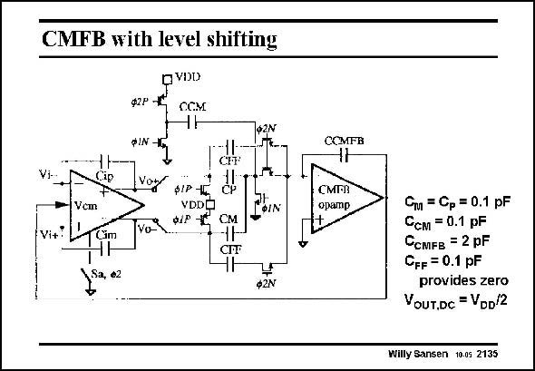

# SANSEN-2135 · CMFB with level shifting

章节：21 低功耗 ΣΔ 模数转换器  
PDF 页：644；书本页：655；幻灯片编号：2135  
状态：unreviewed



## 对应教材讲解

### PDF 643 · 书本 654

Similar level shifting is required in the Common-mode feedback circuit. Again, a capacitor C is added to provide 0.5 V level shifting, between the output of the first CM opamp and the input of the CMFB opamp. The outputs are sampled and summed to cancel out the differential output signals by capacitors C and C (see Chapter 8). The CMFB amplifier P M has a pMOST differential pair at the input such that its input voltage is close to ground as for the other opamps.

### PDF 644 · 书本 655

Capacitors C are in par- FF allel with C and C to pro- P M vide zeros in the CMFB gain characteristic, to speed up the CMFB performance without adding more power (see Chapter 8). These circuits have been used to construct a secondorder filter with a 450 kHz bandwidth (at 1.8 MHz clock frequency). It consumes only 160 mA at 1 V supply voltage (with V Ys T of 0.65 V in 0.5 mm CMOS). Its peak SNR is about 58 dB. The maximum input voltage is 1.6 V , which is ptp very high indeed.

## 公式／性能结论候选摘录

以下为规则截取的原文，尚未逐项判读。

- PDF 644: Capacitors C are in par- FF allel with C and C to pro- P M vide zeros in the CMFB gain characteristic, to speed up the CMFB performance without adding more power (see Chapter 8).
- PDF 644: These circuits have been used to construct a secondorder filter with a 450 kHz bandwidth (at 1.8 MHz clock frequency).

## 曲线结论候选摘录

以下为规则截取的原文，尚未逐项判读。

- PDF 644: Capacitors C are in par- FF allel with C and C to pro- P M vide zeros in the CMFB gain characteristic, to speed up the CMFB performance without adding more power (see Chapter 8).
- PDF 644: Its peak SNR is about 58 dB.

## 原文条件与近似候选摘录

以下为规则截取的原文，尚未逐项判读。

（未由规则找到；不代表原页没有此类内容。）

## 幻灯片 OCR（未校正）

```text
CMFB with level shifting
OVDD
Ф2Р -
CСM
02N
ФIN
CHF
Vem
Vi+:
Voy
фІР-1
VDDg
val *iP K
CM
CFF
1, €2
Ф2N
CСMFB
CMI•R
opamp
Cм = Cp = 0.1 pF
Ссм = 0.1 pF
CсMFB = 2 pF
CFF = 0.1 pF
provides zero
VoUT.DC = VDD/2
Willy Sansen 10.05 2135
```

数学上下标、分数及正负号以原图为准。电路图已保留；未核对的连接不输出成可仿真 netlist。
