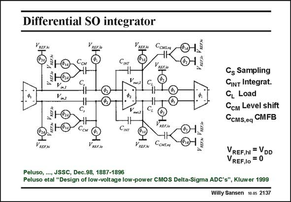

# SANSEN-2137 · Differential SO integrator

章节：21 低功耗 ΣΔ 模数转换器  
PDF 页：645；书本页：656；幻灯片编号：2137  
状态：unreviewed



## 对应教材讲解

### PDF 644 · 书本 655

The switched-opamp integrator is shown in this slide. It is fully-differential. The common-mode feedback is carried out by means of capacitors C . The CMFB circuitry itself is not shown. CMS,eq The functions of the various capacitors is fairly obvious.

### PDF 645 · 书本 656

A DC level shift is again required as the average output voltage is at 50% of the supply voltage and the average input voltage close to ground. This is again realized by means of capacitors C . CM Note that the switches are such that the outputs of the opamp are at V , not to DD forward bias the junctions of the switch transistors.

## 公式／性能结论候选摘录

以下为规则截取的原文，尚未逐项判读。

（未由规则找到；不代表原页没有此类内容。）

## 曲线结论候选摘录

以下为规则截取的原文，尚未逐项判读。

（未由规则找到；不代表原页没有此类内容。）

## 原文条件与近似候选摘录

以下为规则截取的原文，尚未逐项判读。

（未由规则找到；不代表原页没有此类内容。）

## 幻灯片 OCR（未校正）

```text
Differential SO integrator
CINT
CсKSeя
VREEN
Voncs
CL
V-2
C,
+ac?
Cs Sampling
CInT Integrat.
CL Load
Cсм Level shift
CCMS,eq CMFB
VRESь
V RSF.AO
YREFA
VREF.hI = VDD
VREF,10 = 0
Peluso, ..., JSSC, Dec.98, 1887-1896
Peluso etal "Design of low-voltage low-power CMOS Delta-Sigma ADC's", Kluwer 1999
Willy Sansen 10.05 2137
```

数学上下标、分数及正负号以原图为准。电路图已保留；未核对的连接不输出成可仿真 netlist。
