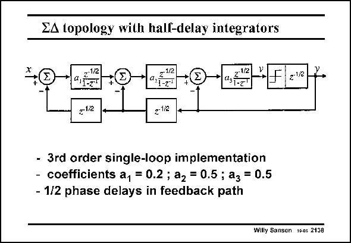

# SANSEN-2138 · ZA topology with half-delay integrators

章节：21 低功耗 ΣΔ 模数转换器  
PDF 页：645；书本页：656；幻灯片编号：2138  
状态：unreviewed



## 对应教材讲解

### PDF 645 · 书本 656

The schematic of the 3rdorder Delta-Sigma converter is shown in this slide. A single-loop topology is selected as it consumes somewhat less power than a 2–1 cascaded topology. Moreover, the gain requirements per stage are less severe. The coefficients have been obtained from Matlab simulations. Care is taken to optimize the output swings for all integrators. For an input swing of 0.2 V, the output swings are respectively 0.36, 0.5 and 0.5 V. In order to avoid an additional opamp to set the timing of the clocks right, half delays are introduced. They are digital and consume very little power.

## 公式／性能结论候选摘录

以下为规则截取的原文，尚未逐项判读。

- PDF 645: Moreover, the gain requirements per stage are less severe.

## 曲线结论候选摘录

以下为规则截取的原文，尚未逐项判读。

（未由规则找到；不代表原页没有此类内容。）

## 原文条件与近似候选摘录

以下为规则截取的原文，尚未逐项判读。

（未由规则找到；不代表原页没有此类内容。）

## 幻灯片 OCR（未校正）

```text
ZA topology with half-delay integrators
-1i2
212
- 3rd order single-loop implementation
- coefficients a, = 0.2 ; a2 = 0.5 ; a3 = 0.5
- 1/2 phase delays in feedback path
Willy Sansen 1006 2138
```

数学上下标、分数及正负号以原图为准。电路图已保留；未核对的连接不输出成可仿真 netlist。
