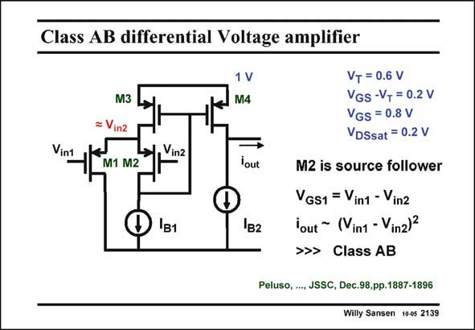

# SANSEN-2139 · Class AB differential Voltage amplifier

章节：21 低功耗 ΣΔ 模数转换器  
PDF 页：646；书本页：657；幻灯片编号：2139  
状态：unreviewed



## 对应教材讲解

### PDF 645 · 书本 656

The opamp used is a class-AB amplifier as shown in this slide. Class AB is preferred as it lowers the quiescent current. It contains two input transistors M1 and M2 and a low-voltage current source M2, M3 and M4. Transistors M2 serve as a source follower as its current is constant and equal to I . This B1 is ensured by the feedback loop around transistors M2 and M3. As a result V is constant as GS2 well. Input voltage V is transferred unattenuated to its Source. in2

### PDF 646 · 书本 657

Input transistor M1 receives thus the differential input voltage V −V as in1 in2 its V . This voltage is con- GS verted into a signal current by transistor M1 only. In this amplifier, only one single transistor M1 converts the differential input voltage into a current. Moreover this transistor provides a class-AB characteristic. The signal current flows through transistors M3 and is mirrored out by transistor M4. It can also be taken out at the Drain of transistor M1 as shown in the full schematic, shown next. Finally, note that this amplifier can operate on less than 1 V supply voltage. It only takes one single V and V to operate properly. If a V is taken of 0.6 V and a V of 0.2 V, then GS DSsat T DSsat the minimum supply voltage V is 1 V. If however, a V is available of 0.3 V, then V can be DD T DD as low as 0.7 V. This is quite low indeed!

## 公式／性能结论候选摘录

以下为规则截取的原文，尚未逐项判读。

- PDF 645: Transistors M2 serve as a source follower as its current is constant and equal to I .
- PDF 645: As a result V is constant as GS2 well.
- PDF 646: Input transistor M1 receives thus the differential input voltage V −V as in1 in2 its V .

## 曲线结论候选摘录

以下为规则截取的原文，尚未逐项判读。

- PDF 646: Moreover this transistor provides a class-AB characteristic.

## 原文条件与近似候选摘录

以下为规则截取的原文，尚未逐项判读。

（未由规则找到；不代表原页没有此类内容。）

## 幻灯片 OCR（未校正）

```text
Class AB differential Voltage amplifier
1 V
M4
Vint
M3
= Vin2
M1 M2
Vinz
lout
IB1
IB2
VT = 0.6 V
VGS -VT = 0.2 V
VGS = 0.8 V
VDSsat = 0.2 V
M2 is source follower
VGS1 = Vin1 - Vinz
lout ~ (Vin1 - Vin2)?
>>> Class AB
Peluso, ..., JSSC, Dec.98,pp.1887-1896
Willy Sansen 10-05 2139
```

数学上下标、分数及正负号以原图为准。电路图已保留；未核对的连接不输出成可仿真 netlist。
