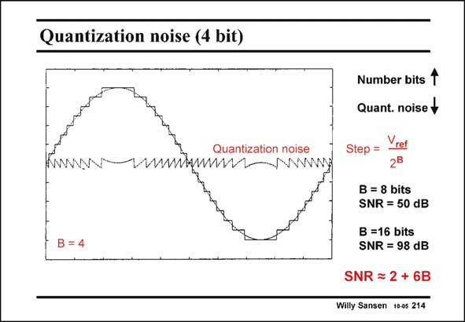

# SANSEN-214 · Quantization noise (4 bit)

章节：21 低功耗 ΣΔ 模数转换器  
PDF 页：628；书本页：639；幻灯片编号：214  
状态：unreviewed



## 对应教材讲解

### PDF 627 · 书本 638

The largest error in such an ADC converter is the quantization noise. This is actually not noise but the difference between the original analog signal and the analog signal, quantized with a limited number of bits. An example is shown in this slide. The original analog signal is the dotted sine wave. The sampled and quantized analog signal for 4 bit (or 16 steps) is shown in full line. The difference is in the middle. It is small in amplitude, depending on the number of bits (B) taken. Moreover, it contains many different frequencies. This is why it is called noise. It is the quantization noise. It is the noise which determines the Signal-to-Noise ratio of the converter and hence its resolution.

### PDF 628 · 书本 639

The size of one single step is the reference voltage divided by 2B in which B is the number of bits; for 8 bits this is 256. For a reference voltage of 1 V, this step is about 4 mV. This is barely larger than mismatch or offset. Additional techniques will be required to enhance the SNR. Noise shaping is such a technique. For this purpose, a noise filter is included in the feedback loop. This is explained in the next slide. For 8 bits, the number of 256 corresponds to 48 dB. The precise value is 2 dB higher, which is 50 dB. For 16 bits we find, in a similar way 98 dB, which is a very high number indeed, this is required by a limited number of applications such as audio CD’s and some others.

## 公式／性能结论候选摘录

以下为规则截取的原文，尚未逐项判读。

- PDF 627: This is actually not noise but the difference between the original analog signal and the analog signal, quantized with a limited number of bits.
- PDF 627: It is small in amplitude, depending on the number of bits (B) taken.
- PDF 628: For 16 bits we find, in a similar way 98 dB, which is a very high number indeed, this is required by a limited number of applications such as audio CD’s and some others.

## 曲线结论候选摘录

以下为规则截取的原文，尚未逐项判读。

（未由规则找到；不代表原页没有此类内容。）

## 原文条件与近似候选摘录

以下为规则截取的原文，尚未逐项判读。

（未由规则找到；不代表原页没有此类内容。）

## 幻灯片 OCR（未校正）

```text
Quantization noise (4 bit)
Number bits 1
Quant. noise+
Quantization noise
ww.wwwww
B = 4
Step =
ref
2B
B = 8 bits
SNR = 50 dB
B =16 bits
SNR = 98 dB
SNR = 2 + 6B
Willy Sansen 10-05 214
```

数学上下标、分数及正负号以原图为准。电路图已保留；未核对的连接不输出成可仿真 netlist。
