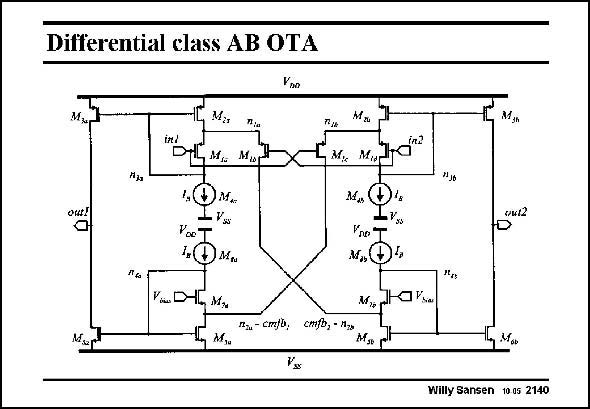

# SANSEN-2140 · Differential class AB OTA

章节：21 低功耗 ΣΔ 模数转换器  
PDF 页：646；书本页：657；幻灯片编号：2140  
状态：unreviewed



## 对应教材讲解

### PDF 646 · 书本 657

In the full schematic, the differential nature is clearly recognized. Input pMOST transistors M and M carry out the 1b 1c input voltage to current conversion. The signal current through transistor M 1b is now fed to the output by current mirror M and 2a M , but also by current 3a mirror M and M . A 5b 6b differential output current is therefore obtained. Common-mode feedback is applied as currents injected at the Drains of transistors M and M . 5a 5b The opamps can be switched in and out by disconnecting all connections to the power supply lines. This ensures a very fast recovery time.

## 公式／性能结论候选摘录

以下为规则截取的原文，尚未逐项判读。

- PDF 646: A 5b 6b differential output current is therefore obtained.

## 曲线结论候选摘录

以下为规则截取的原文，尚未逐项判读。

（未由规则找到；不代表原页没有此类内容。）

## 原文条件与近似候选摘录

以下为规则截取的原文，尚未逐项判读。

（未由规则找到；不代表原页没有此类内容。）

## 幻灯片 OCR（未校正）

```text
Differential class AB OTA
Yno
П:a
ind
DL M Ma
M,u
M. M,JC"?
M,n
"Jo
out!
out2
D
Vac*
I,(
DMn
Viau DHL M
M,u
Ило Т
M,Đ4
N,Cka
",
N% - cm/D,
cmfb, - n,,
Mob
Willy Sansen 10.05 2140
```

数学上下标、分数及正负号以原图为准。电路图已保留；未核对的连接不输出成可仿真 netlist。
