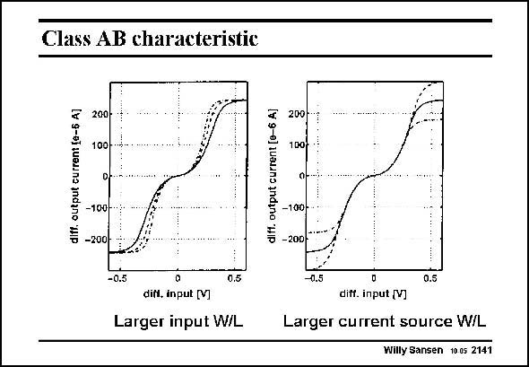

# SANSEN-2141 · Class AB characteristic

章节：21 低功耗 ΣΔ 模数转换器  
PDF 页：647；书本页：658；幻灯片编号：2141  
状态：unreviewed



## 对应教材讲解

### PDF 647 · 书本 658

The class-AB characteristics are clearly visible in this slide. They give the differential output current versus differential input voltage. They also show a curved class-AB characteristic. The biasing currents I B are only of the order of 1 mA. The W/L ratio in the current mirrors is about 120. Relatively large output currents are now available. In the first plot, several values are taken of the input transistors M and M . 1b 1c The larger the input sizes, the steeper the characteristic. In the other plot the biasing current I is varied. As a result, the maximum output current B varies with it. These two parameters allow shaping of the class-AB characteristic.

## 公式／性能结论候选摘录

以下为规则截取的原文，尚未逐项判读。

- PDF 647: As a result, the maximum output current B varies with it.

## 曲线结论候选摘录

以下为规则截取的原文，尚未逐项判读。

- PDF 647: The class-AB characteristics are clearly visible in this slide.
- PDF 647: They also show a curved class-AB characteristic.
- PDF 647: In the first plot, several values are taken of the input transistors M and M . 1b 1c The larger the input sizes, the steeper the characteristic.
- PDF 647: In the other plot the biasing current I is varied.
- PDF 647: These two parameters allow shaping of the class-AB characteristic.

## 原文条件与近似候选摘录

以下为规则截取的原文，尚未逐项判读。

（未由规则找到；不代表原页没有此类内容。）

## 幻灯片 OCR（未校正）

```text
Class AB characteristic
diff. output current [e-5 A]
200
100гm2
-100
-200
diff. output current [e-6 A)
200
100г
O-
-100-
-200
-0.5
0.5
-0.5
0.5
difl. input [V]
Larger input W/L
ditf. input (V)
Larger current source W/L
Willy Sansen 10.05 2141
```

数学上下标、分数及正负号以原图为准。电路图已保留；未核对的连接不输出成可仿真 netlist。
