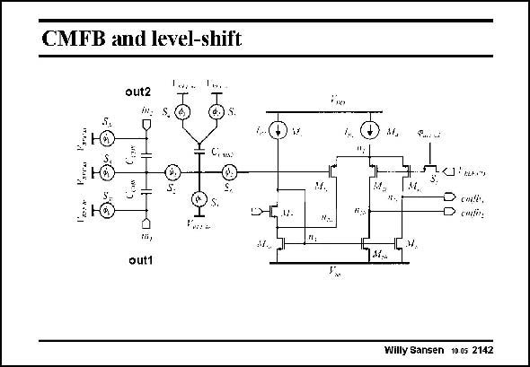

# SANSEN-2142 · CMFB and level-shift

章节：21 低功耗 ΣΔ 模数转换器  
PDF 页：647；书本页：658；幻灯片编号：2142  
状态：unreviewed



## 对应教材讲解

### PDF 647 · 书本 658

Since this is a fullydifferential amplifier, CMFB is required. This is affected by two sampling capacitors C , CMS which cancel out the differential signal at their summation point, which is then fed to a differential amplifier. As two different currents are required to close the feedback loop, one side of the differential amplifier is doubled. In order to realize the half-supply level shift, capacitor C is added, with equal size as capacitor C . CMS2 CMS

## 公式／性能结论候选摘录

以下为规则截取的原文，尚未逐项判读。

- PDF 647: In order to realize the half-supply level shift, capacitor C is added, with equal size as capacitor C .

## 曲线结论候选摘录

以下为规则截取的原文，尚未逐项判读。

（未由规则找到；不代表原页没有此类内容。）

## 原文条件与近似候选摘录

以下为规则截取的原文，尚未逐项判读。

（未由规则找到；不代表原页没有此类内容。）

## 幻灯片 OCR（未校正）

```text
CMFB and level-shift
out2
in:
1ю
M.
mu,
out1
Vara
ligs
• coti.
• cmdir:
M..
Willy Sansen 10.05 2142
```

数学上下标、分数及正负号以原图为准。电路图已保留；未核对的连接不输出成可仿真 netlist。
