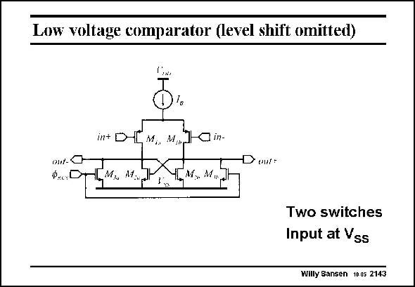

# SANSEN-2143 · Low voltage comparator (level shift omitted)

章节：21 低功耗 ΣΔ 模数转换器  
PDF 页：648；书本页：659；幻灯片编号：2143  
状态：unreviewed



## 对应教材讲解

### PDF 648 · 书本 659

The comparator for the single-bit conversion is shown in this slide. The comparator consists of a differential pair with transistors M1, loaded by a negative resistance (because of the positive feedback) with transistors M2. The gain is sufficiently high to cause a regenerative action yielding a logic on one side and a zero on the other. It consumes about 6 mA. In such a comparator, normally a switch is required between the Drains of the input transistors M1. This switch is closed before the input voltage is applied. As soon as the switch is opened, the regenerative action causes a logic one or zero at the output, depending on the input signal. Because of the low supply voltage however, such a switch is not possible. This function is taken up by the two switches M3. When they are switched off, regenerative action takes place. Note that the average input voltage is again close to ground.

## 公式／性能结论候选摘录

以下为规则截取的原文，尚未逐项判读。

- PDF 648: The gain is sufficiently high to cause a regenerative action yielding a logic on one side and a zero on the other.
- PDF 648: As soon as the switch is opened, the regenerative action causes a logic one or zero at the output, depending on the input signal.

## 曲线结论候选摘录

以下为规则截取的原文，尚未逐项判读。

（未由规则找到；不代表原页没有此类内容。）

## 原文条件与近似候选摘录

以下为规则截取的原文，尚未逐项判读。

（未由规则找到；不代表原页没有此类内容。）

## 幻灯片 OCR（未校正）

```text
Low voltage comparator (level shift omitted)
in+ D-
on-C
Ф...D
НM, M..
M. W,
O in-
Doutr
Two switches
Input at Vss
Willy Sansen 10.05 2143
```

数学上下标、分数及正负号以原图为准。电路图已保留；未核对的连接不输出成可仿真 netlist。
