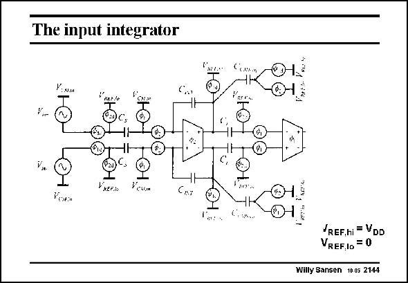

# SANSEN-2144 · The input integrator

章节：21 低功耗 ΣΔ 模数转换器  
PDF 页：648；书本页：659；幻灯片编号：2144  
状态：unreviewed



## 对应教材讲解

### PDF 648 · 书本 659

The input integrator does not have a preceding opamp which can be switched. The input signal will now be limited in amplitude by the input switch. In this realization, the supply voltage is 0.9 V. The minimum voltage drive for the input switch is about 0.65 V, barely larger than the threshold voltage. As a result, the maximum differential input voltage is about 500 mV . ptp

## 公式／性能结论候选摘录

以下为规则截取的原文，尚未逐项判读。

- PDF 648: The input signal will now be limited in amplitude by the input switch.
- PDF 648: As a result, the maximum differential input voltage is about 500 mV . ptp

## 曲线结论候选摘录

以下为规则截取的原文，尚未逐项判读。

（未由规则找到；不代表原页没有此类内容。）

## 原文条件与近似候选摘录

以下为规则截取的原文，尚未逐项判读。

（未由规则找到；不代表原页没有此类内容。）

## 幻灯片 OCR（未校正）

```text
The input integrator
NEFIN
V..A.n
CIs:
Vare..
C,
REF.hi = VDD
VREF.1o = 0
Willy Sansen 10.05 2144
```

数学上下标、分数及正负号以原图为准。电路图已保留；未核对的连接不输出成可仿真 netlist。
