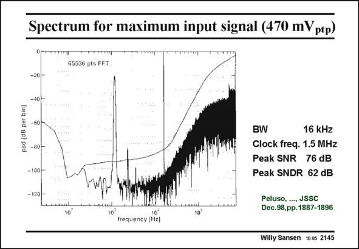

# SANSEN-2145 · Spectrum for maximum input signal (470 mVptp)

章节：21 低功耗 ΣΔ 模数转换器  
PDF 页：649；书本页：660；幻灯片编号：2145  
状态：unreviewed



## 对应教材讲解

### PDF 649 · 书本 660

The output spectrum for the maximum input signal is shown in this slide. The noise floor at low frequencies is quite low. The integrated noise is shown as well. For an input signal of 1 kHz, the SNR is about 76 dB. Distortion is already clearly visible, however. Second-order distortion is present because of the single-ended input drive used for this measurement. The SNDR (signal to noise and distortion ratio) is then only about 62 dB. The bandwidth is about 16 kHz, corresponding to an OSR of 48.

## 公式／性能结论候选摘录

以下为规则截取的原文，尚未逐项判读。

- PDF 649: The bandwidth is about 16 kHz, corresponding to an OSR of 48.

## 曲线结论候选摘录

以下为规则截取的原文，尚未逐项判读。

（未由规则找到；不代表原页没有此类内容。）

## 原文条件与近似候选摘录

以下为规则截取的原文，尚未逐项判读。

（未由规则找到；不代表原页没有此类内容。）

## 幻灯片 OCR（未校正）

```text
Spectrum for maximum input signal (470 mVptp)
65536 pts FET
-20--
-40H
osd idB oer bint
-80-
-100-
BW
16 kHz
Clock freq. 1.5 MHz
Peak SNR 76 dB
Peak SNDR 62 dB
10
Peluso, ..., JSSC
Dec.98,pp.1887-1896
10
trequency (Hz]
10'
Willy Sansen
10.05 2145
```

数学上下标、分数及正负号以原图为准。电路图已保留；未核对的连接不输出成可仿真 netlist。
