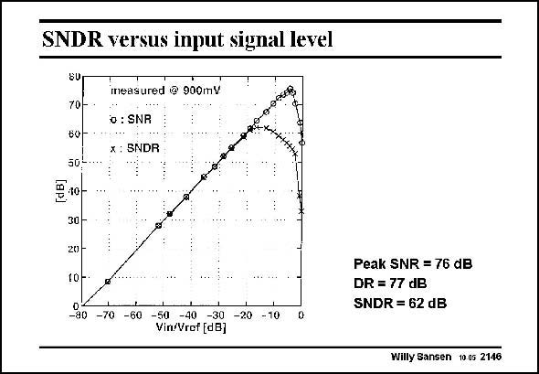

# SANSEN-2146 · SNDR versus input signal level

章节：21 低功耗 ΣΔ 模数转换器  
PDF 页：649；书本页：660；幻灯片编号：2146  
状态：unreviewed



## 对应教材讲解

### PDF 649 · 书本 660

Both the SNR and SNDR are given versus the input signal, for a supply voltage of 0.9 V. It is clear that distortion shows up at the high end, limiting the SNDR to values about 14 dB below the maximum SNR.

## 公式／性能结论候选摘录

以下为规则截取的原文，尚未逐项判读。

- PDF 649: It is clear that distortion shows up at the high end, limiting the SNDR to values about 14 dB below the maximum SNR.

## 曲线结论候选摘录

以下为规则截取的原文，尚未逐项判读。

（未由规则找到；不代表原页没有此类内容。）

## 原文条件与近似候选摘录

以下为规则截取的原文，尚未逐项判读。

（未由规则找到；不代表原页没有此类内容。）

## 幻灯片 OCR（未校正）

```text
SNDR versus input signal level
8U
70-
60-
504
40-
30-
20)
10-
ineasured @ 900mV
o : SNR
x : SNDR
-80
-70
-60
-50
-40
-30
Vin/Vref fdB]
-20
-10
Peak SNR = 76 dB
DR = 77 dB
SNDR = 62 dB
Willy Sansen 10.05 2146
```

数学上下标、分数及正负号以原图为准。电路图已保留；未核对的连接不输出成可仿真 netlist。
