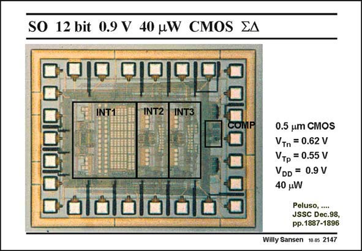

# SANSEN-2147 · SO 12 bit 0.9 V 40 W CMOS EA

章节：21 低功耗 ΣΔ 模数转换器  
PDF 页：650；书本页：661；幻灯片编号：2147  
状态：unreviewed



## 对应教材讲解

### PDF 649 · 书本 660

A microphotograph of this realization is shown in this slide. The first integrator uses larger capacitors (4 pF) to reduce the thermal kT/C noise. This means that for the first integrator the thermal noise is about equal to the quantization noise. For the other stages, the sampling capacitor is only 0.6 pF. A unit capacitor of 0.2 pF has been taken. The power consumption has been minimized by reduction of the currents in the opamps to their minimum. The current consumption of the first stage is larger (33 mA) than for the other stages (6 mA). The current consumption of the CMFB amplifiers is about the same as for the differential ones.

### PDF 650 · 书本 661

Their GBW values are only 2–3 times the clock frequency. They are all 4 MHz, to be compared with a clock frequency of 1.5 MHz. This means that for the first integrator, the thermal noise is about equal to the quantization noise. Remember that in a switched-opamp approach the current consumption is halved by itself. As a result, the power consumption for this resolution and this bandwidth of 16 kHz is very low. This will be illustrated by the comparative Table at the end of this Chapter.

## 公式／性能结论候选摘录

以下为规则截取的原文，尚未逐项判读。

- PDF 649: This means that for the first integrator the thermal noise is about equal to the quantization noise.
- PDF 650: This means that for the first integrator, the thermal noise is about equal to the quantization noise.
- PDF 650: As a result, the power consumption for this resolution and this bandwidth of 16 kHz is very low.

## 曲线结论候选摘录

以下为规则截取的原文，尚未逐项判读。

（未由规则找到；不代表原页没有此类内容。）

## 原文条件与近似候选摘录

以下为规则截取的原文，尚未逐项判读。

（未由规则找到；不代表原页没有此类内容。）

## 幻灯片 OCR（未校正）

```text
SO 12 bit 0.9 V 40 W CMOS EA
INT1
INT2
INT3
0.5 um CMOS
VTn = 0.62 V
VTр = 0.55 V
VDD = 0.9 V
40 uW
Peluso, ....
JSSC Dec.98,
pp.1887-1896
Willy Sansen
10.05 2147
```

数学上下标、分数及正负号以原图为准。电路图已保留；未核对的连接不输出成可仿真 netlist。
