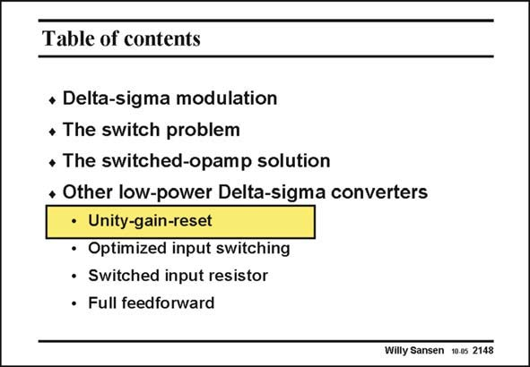

# SANSEN-2148 · Table of contents

章节：21 低功耗 ΣΔ 模数转换器  
PDF 页：650；书本页：661；幻灯片编号：2148  
状态：unreviewed



## 对应教材讲解

### PDF 650 · 书本 661

Several other low-voltage Sigma-Delta converters exist, which all address the problem of the series switches and in particular of the input switch. They all operate at supply voltages below 1 V. The operating principles are discussed next, followed by some discussion on their advantages and disadvantages. The unity-gain-reset principle is first.

## 公式／性能结论候选摘录

以下为规则截取的原文，尚未逐项判读。

- PDF 650: The unity-gain-reset principle is first.

## 曲线结论候选摘录

以下为规则截取的原文，尚未逐项判读。

（未由规则找到；不代表原页没有此类内容。）

## 原文条件与近似候选摘录

以下为规则截取的原文，尚未逐项判读。

（未由规则找到；不代表原页没有此类内容。）

## 幻灯片 OCR（未校正）

```text
Table of contents
* Delta-sigma modulation
• The switch problem
• The switched-opamp solution
+ Other low-power Delta-sigma converters
• Unity-gain-reset
• Optimized input switching
• Switched input resistor
• Full feedforward
Willy Sansen 10.05 2148
```

数学上下标、分数及正负号以原图为准。电路图已保留；未核对的连接不输出成可仿真 netlist。
