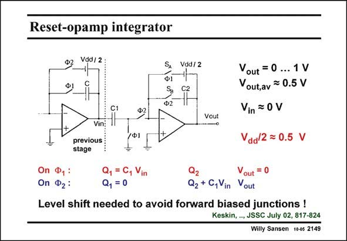

# SANSEN-2149 · Reset-opamp integrator

章节：21 低功耗 ΣΔ 模数转换器  
PDF 页：651；书本页：662；幻灯片编号：2149  
状态：unreviewed



## 对应教材讲解

### PDF 650 · 书本 661

In this principle, the opamp is always reset to ground. In this way, the input switch always has the maximum V , even for small supply voltages. GS In order to understand the principle, let us neglect the level shifters V /2. Also, the voltage dd presented by the previous integrator is called V . in During phase 1 (red), the charge on capacitor C is Q , which is C V . The signal voltage at 1 1 1 in the output V is zero as this opamp is connected in unity-gain configuration (except for a DC out level shift).

### PDF 651 · 书本 662

During phase 2 (blue), this charge C V is transfer- 1 in red to capacitor C . The 2 charge on this capacitor changes by an amount C V such that the output 1 in voltage V changes by an out amount V C /C . in 1 2 During this phase the previous opamp is now reset to zero, as it is connected in unity-gain configuration (except for a DC level shift). Each opamp has zero at its output during one phase and the output voltage during the other phase. There is no problem with switches which have to pass a high signal level, and which have too small a drive voltage V . GS The disadvantage however, is that the output voltages have to swing over a large range for each new clock phase. The Slew Rate must be quite high, leading to more power consumption in the opamps.

## 公式／性能结论候选摘录

以下为规则截取的原文，尚未逐项判读。

- PDF 650: The signal voltage at 1 1 1 in the output V is zero as this opamp is connected in unity-gain configuration (except for a DC out level shift).
- PDF 651: The 2 charge on this capacitor changes by an amount C V such that the output 1 in voltage V changes by an out amount V C /C . in 1 2 During this phase the previous opamp is now reset to zero, as it is connected in unity-gain configuration (except for a DC level shift).

## 曲线结论候选摘录

以下为规则截取的原文，尚未逐项判读。

- PDF 650: Also, the voltage dd presented by the previous integrator is called V . in During phase 1 (red), the charge on capacitor C is Q , which is C V .
- PDF 651: During phase 2 (blue), this charge C V is transfer- 1 in red to capacitor C .
- PDF 651: The 2 charge on this capacitor changes by an amount C V such that the output 1 in voltage V changes by an out amount V C /C . in 1 2 During this phase the previous opamp is now reset to zero, as it is connected in unity-gain configuration (except for a DC level shift).
- PDF 651: Each opamp has zero at its output during one phase and the output voltage during the other phase.
- PDF 651: GS The disadvantage however, is that the output voltages have to swing over a large range for each new clock phase.

## 原文条件与近似候选摘录

以下为规则截取的原文，尚未逐项判读。

- PDF 650: GS In order to understand the principle, let us neglect the level shifters V /2.

## 幻灯片 OCR（未校正）

```text
Reset-opamp integrator
VddI 2 :
SA
Ф1
Ф2
Vdd / 2
C1
Vin:
previous
stage
Vout
/Ф]|
Vout = 0 ... 1 V
Vout,av = 0.5 V
Vin = 0 V
Vaa/2 = 0.5 V
On Ф, :
On Ф2:
Q, =C, Vin
Q, =0
Vout = 0
Q2 +C,Vin Vout
Level shift needed to avoid forward biased junctions !
Keskin, .., JSSC July 02, 817-824
Willy Sansen 10-05 2149
```

数学上下标、分数及正负号以原图为准。电路图已保留；未核对的连接不输出成可仿真 netlist。
