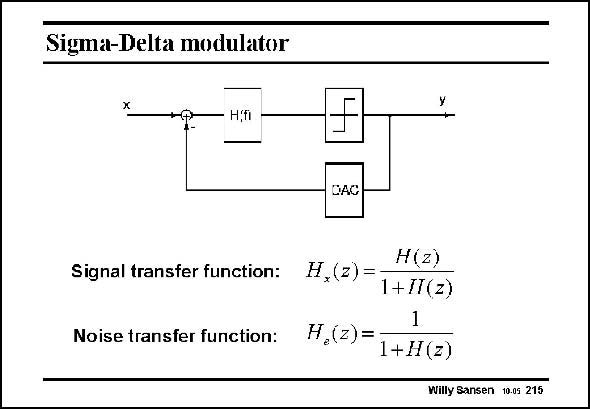

# SANSEN-215 · Sigma-Delta modulator

章节：21 低功耗 ΣΔ 模数转换器  
PDF 页：628；书本页：639；幻灯片编号：215  
状态：unreviewed



## 对应教材讲解

### PDF 628 · 书本 639

The minimum number of components of the Deltasigma feedback loop are the noise filter H(f ), the quantizer and the DAC. For a single-bit converter, the quantizer is only a comparator. The DAC then switches between two DC reference voltages. For multi-bit converters, the quantizer is a real ADC, such a flash ADC or any other type, depending on the speed required. The DAC is then a real multi-bit DAC, in which linearity is one of the main specifications. The higher number of bits, the larger the resolution can be. This is the second design parameter of a Sigma-delta converter, i.e. the number of bits. Many Sigma-Delta converters stick with one single bit conversion as a comparator and a switch from DC reference voltages are so easy to realize. Matching is hardly an issue for singlebit converters. It is clear that for the incoming input signal x, the transfer function is as given in this slide. If H(z) has a high magnitude, the gain is about unity. For noise signals, generated in the feedback loop by the quantizer (comparator) for example,

### PDF 629 · 书本 640

the transfer function is very different. If H(z) has a high magnitude, the quantization noise is reduced considerably. The SNR also increases considerably. A simple example with a low-pass filter is given next.

## 公式／性能结论候选摘录

以下为规则截取的原文，尚未逐项判读。

- PDF 628: For multi-bit converters, the quantizer is a real ADC, such a flash ADC or any other type, depending on the speed required.
- PDF 628: If H(z) has a high magnitude, the gain is about unity.
- PDF 629: The SNR also increases considerably.

## 曲线结论候选摘录

以下为规则截取的原文，尚未逐项判读。

（未由规则找到；不代表原页没有此类内容。）

## 原文条件与近似候选摘录

以下为规则截取的原文，尚未逐项判读。

（未由规则找到；不代表原页没有此类内容。）

## 幻灯片 OCR（未校正）

```text
Sigma-Delta modulator
*T.
H.fi
DAC
Signal transfer function:
Noise transfer function:
H(z)
H,(z)=
1+IT(z)
1
H,(z)=
1+H(z)
Willy Sansen 10.05 215
```

数学上下标、分数及正负号以原图为准。电路图已保留；未核对的连接不输出成可仿真 netlist。
