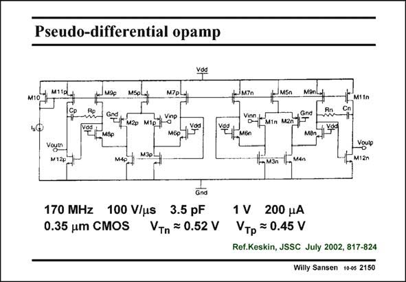

# SANSEN-2150 · Pseudo-differential opamp

章节：21 低功耗 ΣΔ 模数转换器  
PDF 页：651；书本页：662；幻灯片编号：2150  
状态：unreviewed



## 对应教材讲解

### PDF 651 · 书本 662

The opamp configuration is shown in this slide. It is a pseudo-differential amplifier. It consists of two equal but separate amplifiers. Two stages are used for high gain and for large output swing. The GBW and the SR are quite high in view of the clock frequency of 10 MHz. The power consumption is quite low. Note that again DC level shifters are required between outputs and inputs. For maximum output swing the average output voltage is 0.5 V (for a 1 V supply voltage) whereas the average input voltage is close to ground. Such a level shifter can be realized by a few switches and an additional capacitor, as shown before.

## 公式／性能结论候选摘录

以下为规则截取的原文，尚未逐项判读。

- PDF 651: It consists of two equal but separate amplifiers.
- PDF 651: Two stages are used for high gain and for large output swing.

## 曲线结论候选摘录

以下为规则截取的原文，尚未逐项判读。

（未由规则找到；不代表原页没有此类内容。）

## 原文条件与近似候选摘录

以下为规则截取的原文，尚未逐项判读。

（未由规则找到；不代表原页没有此类内容。）

## 幻灯片 OCR（未校正）

```text
Pseudo-differential opamp
vớc
M10
MiTay
J M9p
Msolp
M7P7
Voytn
M12p
*L MSP
M3р
M.4p
FMSn MOnd
vig hin men eno
ve MEn
IM3n IFg men
T[ M1tn
Voup
M12n
Gnd
170 MHz 100 V/us 3.5 pF
0.35 um CMOS VTn = 0.52 V
1 V 200 рA
Vтp = 0.45 V
Ref.Keskin, JSSC July 2002, 817-824
Willy Sansen 10-0s 2150
```

数学上下标、分数及正负号以原图为准。电路图已保留；未核对的连接不输出成可仿真 netlist。
