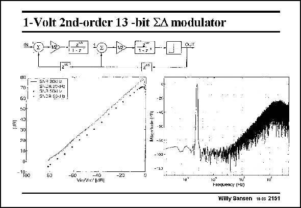

# SANSEN-2151 · 1-Volt 2nd-order 13 -bit &A modulator

章节：21 低功耗 ΣΔ 模数转换器  
PDF 页：652；书本页：663；幻灯片编号：2151  
状态：unreviewed



## 对应教材讲解

### PDF 652 · 书本 663

This integrator is used in a second-order sigma-delta modulator as shown in this slide. Half-delays are used for correct timing. The input sampling capacitance is 2 pF. The maximum SNR is 78 dB for 20 kHz signal bandwidth (clock at 10 MHz). The total power consumption is 5.6 mW at 1 V supply voltage. An 8 dB lower SNR is obtained for a 50 kHz input signal. Note that the distortion is quite low, at the cost of high current consumption in the amplifiers, however.

## 公式／性能结论候选摘录

以下为规则截取的原文，尚未逐项判读。

- PDF 652: The maximum SNR is 78 dB for 20 kHz signal bandwidth (clock at 10 MHz).

## 曲线结论候选摘录

以下为规则截取的原文，尚未逐项判读。

（未由规则找到；不代表原页没有此类内容。）

## 原文条件与近似候选摘录

以下为规则截取的原文，尚未逐项判读。

（未由规则找到；不代表原页没有此类内容。）

## 幻灯片 OCR（未校正）

```text
1-Volt 2nd-order 13 -bit &A modulator
IN.
G9
5S11 20K112
Suh 204r2
ОLА SОHIИ
SNOR GOSIL,
-"loe
-60
VinfVn?[aR|
HreruANy (H2)
Willy Sansen 10.05 2151
```

数学上下标、分数及正负号以原图为准。电路图已保留；未核对的连接不输出成可仿真 netlist。
