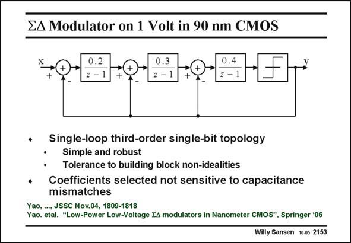

# SANSEN-2153 · EA Modulator on 1 Volt in 90 nm CMOS

章节：21 低功耗 ΣΔ 模数转换器  
PDF 页：653；书本页：664；幻灯片编号：2153  
状态：unreviewed



## 对应教材讲解

### PDF 653 · 书本 664

A single-loop topology is preferred for low-power designs since it is less sensitive to circuit non-idealities such as low opamp gain, switch resistance and capacitor mismatch. A clock is used of 4 MHz and an OSR of 100 to reach a signal bandwidth of 20 kHz. The coefficients are such that the same output swing is obtained for all integrators, which is about 80% of the reference voltage (which is 0.6 V) at an input voltage of −3 dB. The minimum-gain requirement is only about 30 dB. This is easily achieved by a low-voltage opamp as discussed next.

## 公式／性能结论候选摘录

以下为规则截取的原文，尚未逐项判读。

- PDF 653: A single-loop topology is preferred for low-power designs since it is less sensitive to circuit non-idealities such as low opamp gain, switch resistance and capacitor mismatch.
- PDF 653: A clock is used of 4 MHz and an OSR of 100 to reach a signal bandwidth of 20 kHz.
- PDF 653: The minimum-gain requirement is only about 30 dB.

## 曲线结论候选摘录

以下为规则截取的原文，尚未逐项判读。

（未由规则找到；不代表原页没有此类内容。）

## 原文条件与近似候选摘录

以下为规则截取的原文，尚未逐项判读。

（未由规则找到；不代表原页没有此类内容。）

## 幻灯片 OCR（未校正）

```text
EA Modulator on 1 Volt in 90 nm CMOS
+
• Single-loop third-order single-bit topology
Simple and robust
• Tolerance to building block non-idealitis
+ Coefficients selected not sensitive to capacitance
mismatches
Yao, ..., JSSC Nov.04, 1809-1818
Yao. etal. "Low-Power Low-Voltage EA modulators in Nanometer CMOS", Springer '06
Willy Sansen 10.05 2153
```

数学上下标、分数及正负号以原图为准。电路图已保留；未核对的连接不输出成可仿真 netlist。
