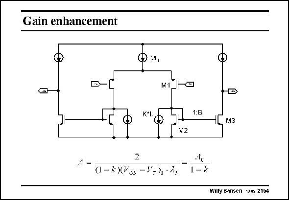

# SANSEN-2154 · Gain enhancement

章节：21 低功耗 ΣΔ 模数转换器  
PDF 页：653；书本页：664；幻灯片编号：2154  
状态：unreviewed



## 对应教材讲解

### PDF 653 · 书本 664

As an opamp a symmetrical OTA is used. Current starving is used however, to increase the gain (see Chapter 7). At such a low supply voltage, too little room is available for cascodes. Current starving means that a DC current source takes away most of the DC current from the load transistors M2. As a result, the AC impedance of these transistors increase, giving rise to more gain. A large factor B is used as well. The first amplifier of this sigma-delta converter uses a k value of 0.8 and a B factor of 10. Actually, factor k indicates what fraction of the current through the input transistor M1 is taken up by the DC current source. The small-signal resistance 1/g of transistors M2 increases m2 by a factor (1−k) in weak inversion, and so does the small-signal gain A.

## 公式／性能结论候选摘录

以下为规则截取的原文，尚未逐项判读。

- PDF 653: Current starving is used however, to increase the gain (see Chapter 7).
- PDF 653: As a result, the AC impedance of these transistors increase, giving rise to more gain.
- PDF 653: The small-signal resistance 1/g of transistors M2 increases m2 by a factor (1−k) in weak inversion, and so does the small-signal gain A.

## 曲线结论候选摘录

以下为规则截取的原文，尚未逐项判读。

（未由规则找到；不代表原页没有此类内容。）

## 原文条件与近似候选摘录

以下为规则截取的原文，尚未逐项判读。

（未由规则找到；不代表原页没有此类内容。）

## 幻灯片 OCR（未校正）

```text
Gain enhancement
21,
M1
(anl
1:B
[ мз
M2
A =
2
(1- k)(Vos - Va)• 2g
1,
1 - k
Willy Sansen 10.05 2154
```

数学上下标、分数及正负号以原图为准。电路图已保留；未核对的连接不输出成可仿真 netlist。
