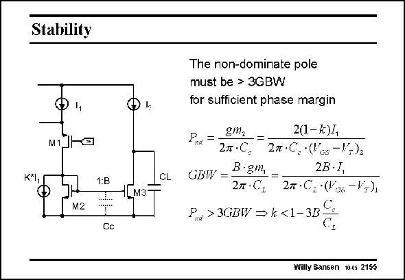

# SANSEN-2155 · Stability

章节：21 低功耗 ΣΔ 模数转换器  
PDF 页：654；书本页：665；幻灯片编号：2155  
状态：unreviewed



## 对应教材讲解

### PDF 654 · 书本 665

Care must be taken however, not to increase the small-signal resistance 1/g m2 too much. Indeed, a nondominant pole p is formed nd at this node. This pole p must be nd kept at 3 GBW to ensure sufficient phase-margin (see Chapter 5). As a result, an upper limit is established on the value of k.

## 公式／性能结论候选摘录

以下为规则截取的原文，尚未逐项判读。

- PDF 654: Care must be taken however, not to increase the small-signal resistance 1/g m2 too much.
- PDF 654: As a result, an upper limit is established on the value of k.

## 曲线结论候选摘录

以下为规则截取的原文，尚未逐项判读。

- PDF 654: This pole p must be nd kept at 3 GBW to ensure sufficient phase-margin (see Chapter 5).

## 原文条件与近似候选摘录

以下为规则截取的原文，尚未逐项判读。

（未由规则找到；不代表原页没有此类内容。）

## 幻灯片 OCR（未校正）

```text
Stability
M1
K*I
1:B
CL
1Lмз
M2
Cc
The non-dominate pole
must be > 3GBW
for sufficient phase margin
Pnd =.
gm2
2(1-k)1,
2n •C.
2m•C. •('os -V+)2
GBW =
B•gm,
2B•I,
2л •Cр
2л•C2 (V% -V=)
Pu > 3CIBWV → k<1-382
Willy Sansen 10.05 2155
```

数学上下标、分数及正负号以原图为准。电路图已保留；未核对的连接不输出成可仿真 netlist。
