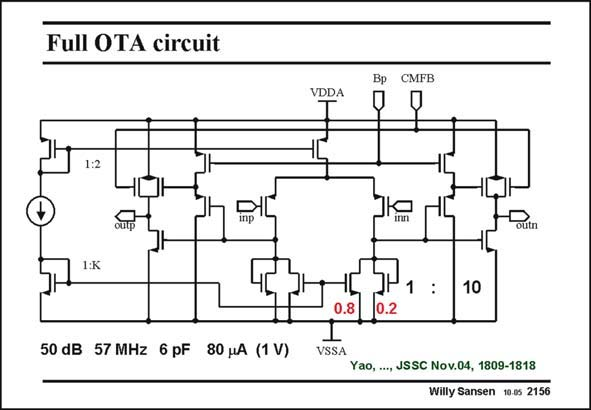

# SANSEN-2156 · Full OTA circuit

章节：21 低功耗 ΣΔ 模数转换器  
PDF 页：654；书本页：665；幻灯片编号：2156  
状态：unreviewed



## 对应教材讲解

### PDF 654 · 书本 665

The total opamp schematic is shown in this slide. The current-starving symmetrical OTA serves as a first stage of a two-stage amplifier. An output stage is required to reach rail-to-rail output swing. It is a class- AB amplifier at the same time. It is a fairly simple class-AB amplifier with a main purpose of increasing the Slew-Rate, without too much distortion. Node Bp is a fixed biasing point, which determines the class AB operating point. CMFB is the output of a separate CMFB amplifier, realized by switched capacitors. For load capacitors of 6 pF, as used in the first integrator, the GBW is 57 MHz for only 80 mA current consumption. The gain is about 50 dB, which is a lot more than 30 dB.

## 公式／性能结论候选摘录

以下为规则截取的原文，尚未逐项判读。

- PDF 654: The gain is about 50 dB, which is a lot more than 30 dB.

## 曲线结论候选摘录

以下为规则截取的原文，尚未逐项判读。

（未由规则找到；不代表原页没有此类内容。）

## 原文条件与近似候选摘录

以下为规则截取的原文，尚未逐项判读。

（未由规则找到；不代表原页没有此类内容。）

## 幻灯片 OCR（未校正）

```text
Full OTA circuit
1:2
50 dB 57 MHz 6 pF 80 A (1 V)
CMFB
VDDA
Bp
Outn
1
10
0.2
VSSA
Yao, ..., JSSC Nov.04, 1809-1818
Willy Sansen 10.05 2156
```

数学上下标、分数及正负号以原图为准。电路图已保留；未核对的连接不输出成可仿真 netlist。
