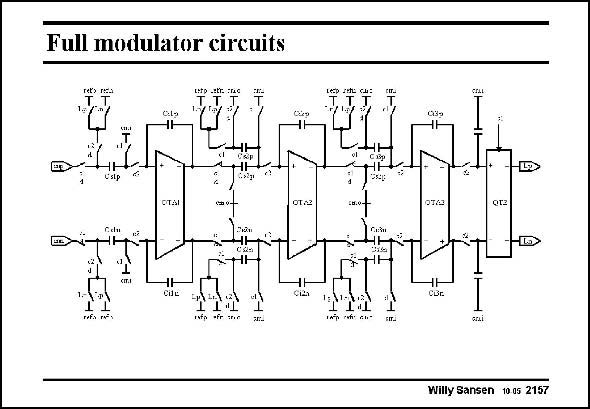

# SANSEN-2157 · Full modulator circuits

章节：21 低功耗 ΣΔ 模数转换器  
PDF 页：655；书本页：666；幻灯片编号：2157  
状态：unreviewed



## 对应教材讲解

### PDF 655 · 书本 666

The full schematic of the sigma-delta modulator is shown in this slide. The first integrator takes most of the current as it is designed for 6 pF sampling capacitors. The other two integrators only use 0.4 pF capacitors. Their power consumption is much lower. All commonmode output voltages are 0.5 V, whereas the input ones are 0.2 V. All switches are implemented as transmission gates. Despite the low supply voltage, sufficient V is available for all switches. Indeed, the threshold voltages are GS about 0.3 V. Vertical metal-wall capacitors are used with values of 1.7 fF/mm2. No horizontal capacitors were available.

## 公式／性能结论候选摘录

以下为规则截取的原文，尚未逐项判读。

（未由规则找到；不代表原页没有此类内容。）

## 曲线结论候选摘录

以下为规则截取的原文，尚未逐项判读。

（未由规则找到；不代表原页没有此类内容。）

## 原文条件与近似候选摘录

以下为规则截取的原文，尚未逐项判读。

（未由规则找到；不代表原页没有此类内容。）

## 幻灯片 OCR（未校正）

```text
Full modulator circuits
TTT°
Cilo
CTM
OTA2
"tt
T
01/0
Willy Sansen 10.a5 2157
```

数学上下标、分数及正负号以原图为准。电路图已保留；未核对的连接不输出成可仿真 netlist。
