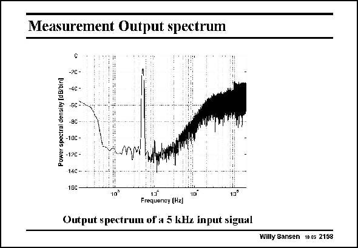

# SANSEN-2158 · Measurement Output spectrum

章节：21 低功耗 ΣΔ 模数转换器  
PDF 页：655；书本页：666；幻灯片编号：2158  
状态：unreviewed



## 对应教材讲解

### PDF 655 · 书本 666

The output spectrum for a 5 kHz input signal is shown in this slide. A peak SNR is reached of 85 dB while the peak SNDR is 81 dB. The consumption is then 130 mA (at 1 V supply voltage) for the analog part and 10 mA for the digital part.

## 公式／性能结论候选摘录

以下为规则截取的原文，尚未逐项判读。

（未由规则找到；不代表原页没有此类内容。）

## 曲线结论候选摘录

以下为规则截取的原文，尚未逐项判读。

- PDF 655: A peak SNR is reached of 85 dB while the peak SNDR is 81 dB.

## 原文条件与近似候选摘录

以下为规则截取的原文，尚未逐项判读。

（未由规则找到；不代表原页没有此类内容。）

## 幻灯片 OCR（未校正）

```text
Measurement Output spectrum
-2C-
Power spectra densite dBioin
GC
8C
-10C
-12C
14C -
1GC
10%
Frequeney (Hz]
Output spectrum of a 5 kHe input sigual
Willy Sansen 10.05 2158
```

数学上下标、分数及正负号以原图为准。电路图已保留；未核对的连接不输出成可仿真 netlist。
