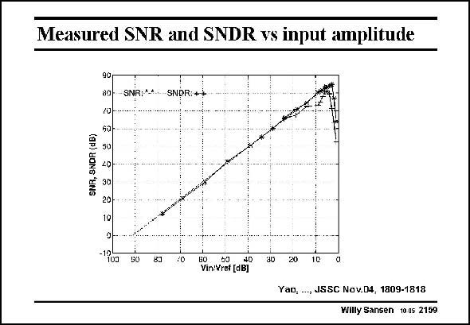

# SANSEN-2159 · Measured SNR and SNDR vs input amplitude

章节：21 低功耗 ΣΔ 模数转换器  
PDF 页：656；书本页：667；幻灯片编号：2159  
状态：unreviewed



## 对应教材讲解

### PDF 656 · 书本 667

Both the peak SNR and SNDR are shown in this slide. They reach values of 85 and 81 dB respectively. The reference voltage is 0.6 V.

## 公式／性能结论候选摘录

以下为规则截取的原文，尚未逐项判读。

（未由规则找到；不代表原页没有此类内容。）

## 曲线结论候选摘录

以下为规则截取的原文，尚未逐项判读。

- PDF 656: Both the peak SNR and SNDR are shown in this slide.

## 原文条件与近似候选摘录

以下为规则截取的原文，尚未逐项判读。

（未由规则找到；不代表原页没有此类内容。）

## 幻灯片 OCR（未校正）

```text
Measured SNR and SNDR vs input amplitude
SNR. SNOR (dB)
90
80
70
60-
SNR SNOR 1
20
30
20
10
-"oa
SO
83
/0
60
4D
Vin:Vref (dB]
30
20
1C
YaD.
., JSSC Nov.D4, 1809-1818
Willy Sansen 10.05 2159
```

数学上下标、分数及正负号以原图为准。电路图已保留；未核对的连接不输出成可仿真 netlist。
