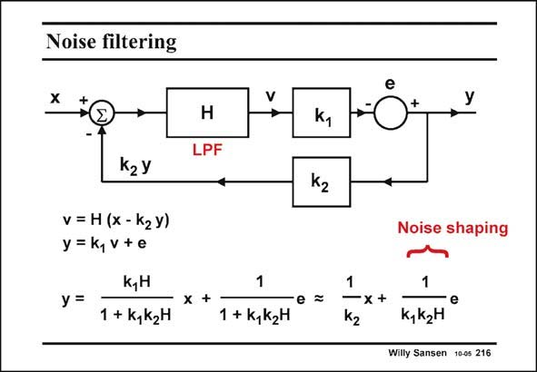

# SANSEN-216 · Noise filtering

章节：21 低功耗 ΣΔ 模数转换器  
PDF 页：629；书本页：640；幻灯片编号：216  
状态：unreviewed



## 对应教材讲解

### PDF 629 · 书本 640

The simplest possible feedback loop with such a noise filter H is shown in this slide. Its gain is k . The (quantiza- 1 tion) noise or error signal in general is represented by e. The feedback loop is closed over a block with gain k . 2 From the network equations it is clear the gains for the incoming signal x and for the error signal e are very different indeed. For a large loop gain 1+k k H, the gain for the 1 2 incoming signal is 1/k , 2 whereas the gain for the error signal (quantization noise) can be quite small. This latter filter action is the actual noise shaping. This is evident if a first-order low-pass filter is taken for filter H, as shown next.

## 公式／性能结论候选摘录

以下为规则截取的原文，尚未逐项判读。

- PDF 629: Its gain is k .
- PDF 629: The feedback loop is closed over a block with gain k . 2 From the network equations it is clear the gains for the incoming signal x and for the error signal e are very different indeed.
- PDF 629: For a large loop gain 1+k k H, the gain for the 1 2 incoming signal is 1/k , 2 whereas the gain for the error signal (quantization noise) can be quite small.

## 曲线结论候选摘录

以下为规则截取的原文，尚未逐项判读。

（未由规则找到；不代表原页没有此类内容。）

## 原文条件与近似候选摘录

以下为规则截取的原文，尚未逐项判读。

（未由规则找到；不代表原页没有此类内容。）

## 幻灯片 OCR（未校正）

```text
Noise filtering
H
LPF
V
k2 Y
v = H (x -kгy)
y =k,V+e
y =
k,H
1 + k, k2H
X
1
1 + k,k2H
ky
k2
Noise shaping
1
e
k, K2H
Willy Sansen 10-05 216
```

数学上下标、分数及正负号以原图为准。电路图已保留；未核对的连接不输出成可仿真 netlist。
