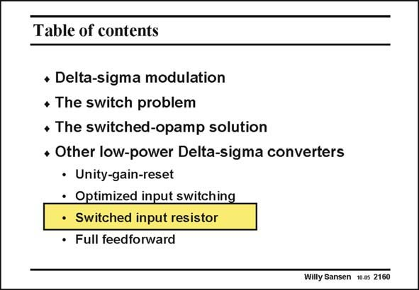

# SANSEN-2160 · Table of contents

章节：21 低功耗 ΣΔ 模数转换器  
PDF 页：656；书本页：667；幻灯片编号：2160  
状态：unreviewed



## 对应教材讲解

### PDF 656 · 书本 667

Other low-power sigma delta converters are discussed. They again address the input switch to improve the SNDR ratio. In this one, a series resistor is used at the input, which replaces the input switch.

## 公式／性能结论候选摘录

以下为规则截取的原文，尚未逐项判读。

（未由规则找到；不代表原页没有此类内容。）

## 曲线结论候选摘录

以下为规则截取的原文，尚未逐项判读。

（未由规则找到；不代表原页没有此类内容。）

## 原文条件与近似候选摘录

以下为规则截取的原文，尚未逐项判读。

（未由规则找到；不代表原页没有此类内容。）

## 幻灯片 OCR（未校正）

```text
Table of contents
• Delta-sigma modulation
• The switch problem
• The switched-opamp solution
* Other low-power Delta-sigma converters
• Unity-gain-reset
• Optimized input switching
• Switched input resistor
• Full feedforward
Willy Sansen 10.05 2160
```

数学上下标、分数及正负号以原图为准。电路图已保留；未核对的连接不输出成可仿真 netlist。
