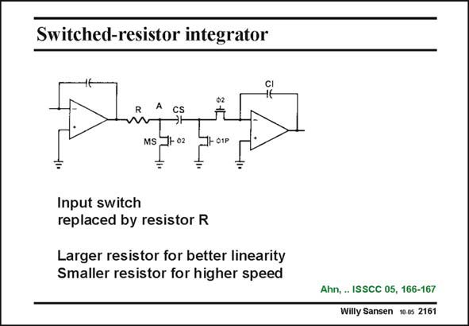

# SANSEN-2161 · Switched-resistor integrator

章节：21 低功耗 ΣΔ 模数转换器  
PDF 页：657；书本页：668；幻灯片编号：2161  
状态：unreviewed



## 对应教材讲解

### PDF 657 · 书本 668

In the switched-capacitor integrator, shown in this slide, the input switch is replaced by a resistor R. On phase W1P the sampling capacitor C is charged to S the output voltage of the first opamp. On phase W2 the charge is then transferred to integration capacitor C . I The use of this resistor R has several advantages. First of all, it avoids the need to use a switch. This switch is difficult to drive because of the low supply voltage. Moreover, the linearity is quite high provided the ON-resistance of switch W1P can be made small. The drawback is that an additional time constant RC comes in, which may limit the high- S frequency performance. This is a low-frequency solution.

## 公式／性能结论候选摘录

以下为规则截取的原文，尚未逐项判读。

- PDF 657: The drawback is that an additional time constant RC comes in, which may limit the high- S frequency performance.

## 曲线结论候选摘录

以下为规则截取的原文，尚未逐项判读。

- PDF 657: On phase W1P the sampling capacitor C is charged to S the output voltage of the first opamp.
- PDF 657: On phase W2 the charge is then transferred to integration capacitor C .

## 原文条件与近似候选摘录

以下为规则截取的原文，尚未逐项判读。

- PDF 657: Moreover, the linearity is quite high provided the ON-resistance of switch W1P can be made small.

## 幻灯片 OCR（未校正）

```text
Switched-resistor integrator
R A
MS
J+02
+ 01P
Input switch
replaced by resistor R
Larger resistor for better linearity
Smaller resistor for higher speed
Ahn, .. ISSCC 05, 166-167
Willy Sansen 10.0s 2161
```

数学上下标、分数及正负号以原图为准。电路图已保留；未核对的连接不输出成可仿真 netlist。
