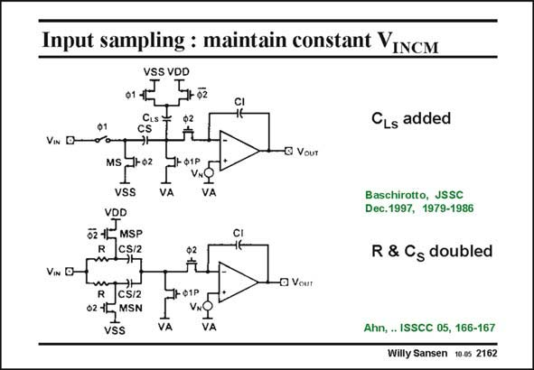

# SANSEN-2162 · Input sampling : maintain constant VINCM

章节：21 低功耗 ΣΔ 模数转换器  
PDF 页：657；书本页：668；幻灯片编号：2162  
状态：unreviewed



## 对应教材讲解

### PDF 657 · 书本 668

For low supply voltages, it is difficult to maintain the input common-mode voltage constant during the switching. In order to suppress this change in common-mode input voltage, several solutions exist. In the top one, a capacitor C is added, connected to Ls the supply lines. It acts as a DC level shifter, as previously described. In the solution at the bottom, the input resistor R and sampling capacitor C S are doubled, allowing the cancellation of the input common-mode voltage. This results in less kT/C noise.

## 公式／性能结论候选摘录

以下为规则截取的原文，尚未逐项判读。

（未由规则找到；不代表原页没有此类内容。）

## 曲线结论候选摘录

以下为规则截取的原文，尚未逐项判读。

（未由规则找到；不代表原页没有此类内容。）

## 原文条件与近似候选摘录

以下为规则截取的原文，尚未逐项判读。

（未由规则找到；不代表原页没有此类内容。）

## 幻灯片 OCR（未校正）

```text
Input sampling : maintain constant VINCM
VN D
VIN O-
VSS VDD
012
5702
CLs:
CS
Ф2
→
MS
-02
•ф1Р
VSS
VDD
02 42 MSP
R
I5/2
VA
VA
$2
*
R
CS/2
02-15 MSN
vSS
VA
1-01P|
VNg
VA
-G Vout
-D Vour
CLs added
Baschirotto, JSSC
Dec. 1997, 1979-1986
R & Cs doubled
Ahn, .. ISSCC 05, 166-167
Willy Sansen 10.05 2162
```

数学上下标、分数及正负号以原图为准。电路图已保留；未核对的连接不输出成可仿真 netlist。
