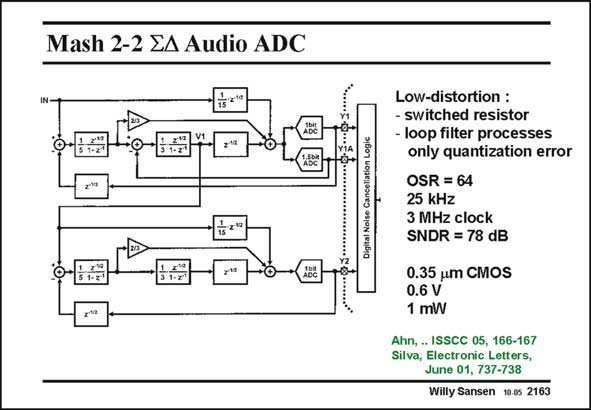

# SANSEN-2163 · Mash 2-2 EA Audio ADC

章节：21 低功耗 ΣΔ 模数转换器  
PDF 页：658；书本页：669；幻灯片编号：2163  
状态：unreviewed



## 对应教材讲解

### PDF 658 · 书本 669

The sigma-delta converter itself is a fourth-order MASH 2–2 converter. In the first second-order loop, the loop filter only processes the quantization error. The signal amplitudes are therefore much smaller and much lower distortion levels are obtained. As a result, the second stage does not contain the signal any more. No additional subtraction is now required in the coupling between both stages. It is clear from the coefficients used, that the feedforward causes quantization noise only in the feedback loop.

## 公式／性能结论候选摘录

以下为规则截取的原文，尚未逐项判读。

- PDF 658: The signal amplitudes are therefore much smaller and much lower distortion levels are obtained.
- PDF 658: As a result, the second stage does not contain the signal any more.

## 曲线结论候选摘录

以下为规则截取的原文，尚未逐项判读。

（未由规则找到；不代表原页没有此类内容。）

## 原文条件与近似候选摘录

以下为规则截取的原文，尚未逐项判读。

- PDF 658: The signal amplitudes are therefore much smaller and much lower distortion levels are obtained.

## 幻灯片 OCR（未校正）

```text
Mash 2-2 EA Audio ADC
Dicital Noise Cancellation Loaia
O-
Low-distortion :
- switched resistor
- loop filter processes
only quantization error
OSR = 64
25 kHz
3 MHz clock
SNDR = 78 dB
0.35 um CMOS
0.6 V
1 mW
Ahn, .. ISSCC 05, 166-167
Silva, Electronic Letters,
June 01, 737-738
Willy Sansen 10.05 2163
```

数学上下标、分数及正负号以原图为准。电路图已保留；未核对的连接不输出成可仿真 netlist。
