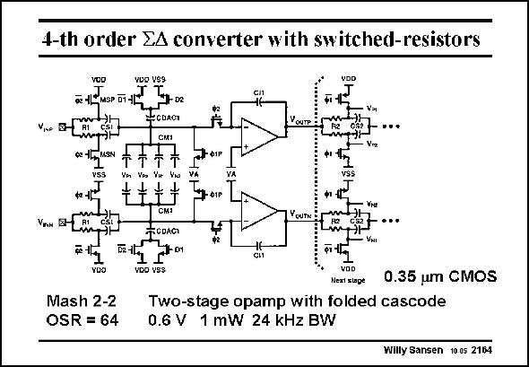

# SANSEN-2164 · 4-th order EA converter with switched-resistors

章节：21 低功耗 ΣΔ 模数转换器  
PDF 页：658；书本页：669；幻灯片编号：2164  
状态：unreviewed



## 对应教材讲解

### PDF 658 · 书本 669

The circuit implementation is shown in this slide. The switched input resistors are easily found. Everything is fully differential. The CMFB is applied through the capacitors CM1. On phase W1P the signal is sampled onto sampling capacitors C . On phase W2 S1 the charge is then transferred to the integration capacitors C by connecting the I1 bottom plate of each capacitor to V or V (which is DD SS ground).

## 公式／性能结论候选摘录

以下为规则截取的原文，尚未逐项判读。

（未由规则找到；不代表原页没有此类内容。）

## 曲线结论候选摘录

以下为规则截取的原文，尚未逐项判读。

- PDF 658: On phase W1P the signal is sampled onto sampling capacitors C .
- PDF 658: On phase W2 S1 the charge is then transferred to the integration capacitors C by connecting the I1 bottom plate of each capacitor to V or V (which is DD SS ground).

## 原文条件与近似候选摘录

以下为规则截取的原文，尚未逐项判读。

（未由规则找到；不代表原页没有此类内容。）

## 幻灯片 OCR（未校正）

```text
4-th order EA converter with switched-resistors
o 14
MSP D1-1L
V.c B CC
ECOAGT
IASN
IФIР
Vin
Yps
Yw
VA
vSS
7-01р
YOUTN
Vra
VEн D-
F2 1L
FODAGI
+1-01
сИ
Mash 2-2
OSR = 64
VOD
Next slage
0.35 um CMOS
Two-stage opamp with folded cascode
0.6 V 1 mW 24 kHz BW
Willy Sansen 10.05 2164
```

数学上下标、分数及正负号以原图为准。电路图已保留；未核对的连接不输出成可仿真 netlist。
