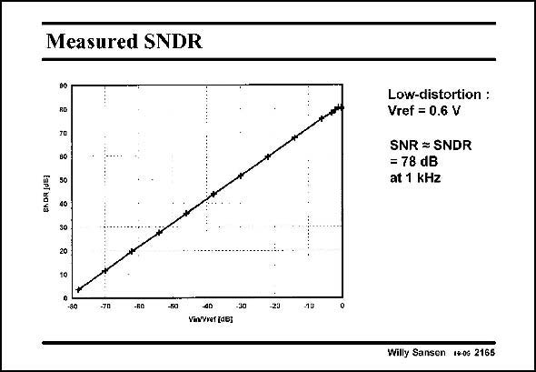

# SANSEN-2165 · Measured SNDR

章节：21 低功耗 ΣΔ 模数转换器  
PDF 页：659；书本页：670；幻灯片编号：2165  
状态：unreviewed



## 对应教材讲解

### PDF 659 · 书本 670

The measured SNDR is shown in this slide. The SNR is the same, since the distortion is very low up to the reference voltage. This means that both the supply voltage and the reference voltage are 0.6 V. For an input voltage of 0.6 V a ptp SNDR is obtained of 78 dB. This is quite impressive indeed. The maximum signal bandwidth is about 24 kHz. It has been realized in 0.35 mm CMOS and consumes only 1 mW at 0.6 V.

## 公式／性能结论候选摘录

以下为规则截取的原文，尚未逐项判读。

- PDF 659: The maximum signal bandwidth is about 24 kHz.

## 曲线结论候选摘录

以下为规则截取的原文，尚未逐项判读。

（未由规则找到；不代表原页没有此类内容。）

## 原文条件与近似候选摘录

以下为规则截取的原文，尚未逐项判读。

（未由规则找到；不代表原页没有此类内容。）

## 幻灯片 OCR（未校正）

```text
Measured SNDR
80
RD
SMOR IJ5]
B0
50
40
Low-distortion :
Vref = 0.6 V
SNR = SNDR
= 78 dB
at 1 kHz
20
-30
-60
-80
40
ViVwf (dB;
-30
20
-10
Willy Sansen 1+-06 2165
```

数学上下标、分数及正负号以原图为准。电路图已保留；未核对的连接不输出成可仿真 netlist。
