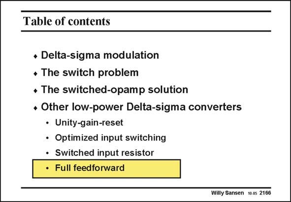

# SANSEN-2166 · Table of contents

章节：21 低功耗 ΣΔ 模数转换器  
PDF 页：659；书本页：670；幻灯片编号：2166  
状态：unreviewed



## 对应教材讲解

### PDF 659 · 书本 670

The main advantage of feedforward is that only quantization noise is processed by the feedback loop. As a result, the input swing can be made larger without distortion. This is also the case in the next and last sigma-delta modulator of this Chapter.

## 公式／性能结论候选摘录

以下为规则截取的原文，尚未逐项判读。

- PDF 659: As a result, the input swing can be made larger without distortion.

## 曲线结论候选摘录

以下为规则截取的原文，尚未逐项判读。

（未由规则找到；不代表原页没有此类内容。）

## 原文条件与近似候选摘录

以下为规则截取的原文，尚未逐项判读。

（未由规则找到；不代表原页没有此类内容。）

## 幻灯片 OCR（未校正）

```text
Table of contents
• Delta-sigma modulation
• The switch problem
+ The switched-opamp solution
• Other low-power Delta-sigma converters
• Unity-gain-reset
• Optimized input switching
• Switched input resistor
• Full feedforward
Willy Sansen 10.05 2166
```

数学上下标、分数及正负号以原图为准。电路图已保留；未核对的连接不输出成可仿真 netlist。
