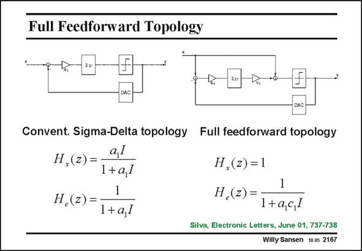

# SANSEN-2167 · Full Feedforward Topology

章节：21 低功耗 ΣΔ 模数转换器  
PDF 页：660；书本页：671；幻灯片编号：2167  
状态：unreviewed



## 对应教材讲解

### PDF 660 · 书本 671

Full feedforward means that the input signal is fed directly to the quantizer. As a result, the noise transfer function H (z) is the same as e in a conventional topology but the signal transfer function H (z) is unity. This sugx gests that the distortion is a lot less in the full-feedforward topology. Indeed, the signal goes directly to the quantizer without passing through the loop filter integrators. These filters only process the quantization error, which is much smaller in amplitude than the signal itself. The distortion will be a lot less indeed. The overload level can be higher and so is the dynamic range.

## 公式／性能结论候选摘录

以下为规则截取的原文，尚未逐项判读。

- PDF 660: As a result, the noise transfer function H (z) is the same as e in a conventional topology but the signal transfer function H (z) is unity.

## 曲线结论候选摘录

以下为规则截取的原文，尚未逐项判读。

（未由规则找到；不代表原页没有此类内容。）

## 原文条件与近似候选摘录

以下为规则截取的原文，尚未逐项判读。

- PDF 660: These filters only process the quantization error, which is much smaller in amplitude than the signal itself.

## 幻灯片 OCR（未校正）

```text
Full Feedforward Topology
Convent. Sigma-Delta topology Full feedforward topology
a,I
H,(z) =
1+a,l
H.(z) =
1
1+a,l
H,(z) =1
1
H,(z) =
1+a,c,]
Silva, Electronic Letters, June 01, 737-738
Willy Sansen 10.05 2167
```

数学上下标、分数及正负号以原图为准。电路图已保留；未核对的连接不输出成可仿真 netlist。
