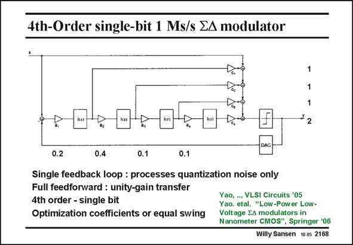

# SANSEN-2168 · 4th-Order single-bit 1 Ms/s EA modulator

章节：21 低功耗 ΣΔ 模数转换器  
PDF 页：660；书本页：671；幻灯片编号：2168  
状态：unreviewed



## 对应教材讲解

### PDF 660 · 书本 671

A 4th-order single-bit sigma-delta converter with full feedforward is shown in this slide. Eight gain coefficients have to be determined, which is only possible by optimization of the SNR and by equalization of the swings at the integrator outputs. This is achieved by means of behavioral simulation. One of the many possible solutions is indicated. Remember that the signal gain is unity and that the loop filters only process the quantization noise. This reduces the distortion considerably, as shown next.

## 公式／性能结论候选摘录

以下为规则截取的原文，尚未逐项判读。

- PDF 660: Eight gain coefficients have to be determined, which is only possible by optimization of the SNR and by equalization of the swings at the integrator outputs.
- PDF 660: Remember that the signal gain is unity and that the loop filters only process the quantization noise.

## 曲线结论候选摘录

以下为规则截取的原文，尚未逐项判读。

（未由规则找到；不代表原页没有此类内容。）

## 原文条件与近似候选摘录

以下为规则截取的原文，尚未逐项判读。

（未由规则找到；不代表原页没有此类内容。）

## 幻灯片 OCR（未校正）

```text
4th-Order single-bit 1 Ms/s EA modulator
1
1
1
* 2
0.2
0.4
0.1
0.1
Single feedback loop : processes quantization noise only
Full feedforward : unity-gain transfer
4th order - single bit
Optimization coefficients or equal swing
Yao, .., VLSI Circuits '05
Yao. etal. "Low-Pow er Low-
Voltage EA modulators in
Nanometer CMOS", Springer '06
Willy Sansen 10.05 2168
```

数学上下标、分数及正负号以原图为准。电路图已保留；未核对的连接不输出成可仿真 netlist。
