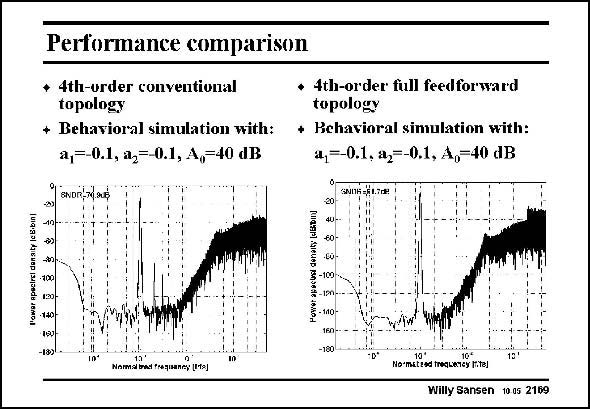

# SANSEN-2169 · Performance comparison

章节：21 低功耗 ΣΔ 模数转换器  
PDF 页：661；书本页：672；幻灯片编号：2169  
状态：unreviewed



## 对应教材讲解

### PDF 661 · 书本 672

First of all, the gain itself can be relaxed from 60 to 30 dB, which is easily achieved, even in nanometer CMOS at 1 V supply voltage. Moreover, the effect of the distortion is much smaller. The gain of each opamp is modeled as given by A=A (1+a v +a v 2) 0 1 o 2 o in which the a represents 1 the second-order non-linearity and a the third- 2 order one. It is shown in this slide that for equal nonlinearities in the opamps, full feedforward considerably reduces the distortion at the output. Only a modest gain of 40 dB is used. This is not sufficient for a conventional sigma-delta converter, but more than sufficient for the full-feedforward one.

## 公式／性能结论候选摘录

以下为规则截取的原文，尚未逐项判读。

- PDF 661: First of all, the gain itself can be relaxed from 60 to 30 dB, which is easily achieved, even in nanometer CMOS at 1 V supply voltage.
- PDF 661: The gain of each opamp is modeled as given by A=A (1+a v +a v 2) 0 1 o 2 o in which the a represents 1 the second-order non-linearity and a the third- 2 order one.
- PDF 661: It is shown in this slide that for equal nonlinearities in the opamps, full feedforward considerably reduces the distortion at the output.
- PDF 661: Only a modest gain of 40 dB is used.

## 曲线结论候选摘录

以下为规则截取的原文，尚未逐项判读。

（未由规则找到；不代表原页没有此类内容。）

## 原文条件与近似候选摘录

以下为规则截取的原文，尚未逐项判读。

- PDF 661: Moreover, the effect of the distortion is much smaller.

## 幻灯片 OCR（未校正）

```text
Performance comparison
+ 4th-urder conventional
• 4th-order full feedforward
topology
topology
+ Behavioral simulation with: + Behavioral simulation with:
a,--0.1, a2--0.1, A,=40 dB
4,--0.1, a,=-0.1, A,-40 dB
GNDn;7(, 98)
SNNH-AI.7ON
Powar apecirel danaity le Bben l
-109
- 140-
-18>
MAMADA PATUR (1)
No-mstisd trequienty fite)
Willy Sansen 10.05 2169
```

数学上下标、分数及正负号以原图为准。电路图已保留；未核对的连接不输出成可仿真 netlist。
