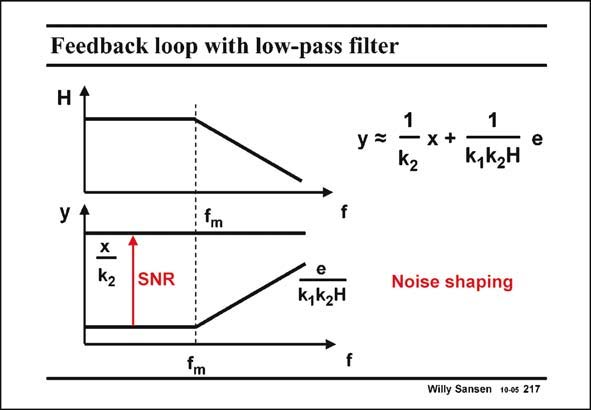

# SANSEN-217 · Feedback loop with low-pass filter

章节：21 低功耗 ΣΔ 模数转换器  
PDF 页：629；书本页：640；幻灯片编号：217  
状态：unreviewed



## 对应教材讲解

### PDF 629 · 书本 640

When a low-pass filter of first order is taken for H, with cut-off frequency f m and slope −20 dB/decade, the contribution of the error (noise) signal in the output y shows an inverted characteristic. Its contribution is low at frequencies below f m and it increases at 20 dB/ decade for higher frequencies. The noise is pushed towards higher frequencies. At low frequencies, the SNR is the ratio of x/k and 2 e/k k H. This is propor- 1 2 tional to k , which is the gain in the forward path of the feedback loop. The higher this gain, 1 the higher the SNR. Also, the higher the order of the filter, the steeper the slope of the noise beyond frequency f . m

### PDF 630 · 书本 641

Higher-order filters allow higher values of k . As a result, higher-order filters give rise to higher 1 SNR values. The order of this filter is therefore the third design parameter of a Sigma-delta converter. Recall that the other two are the oversampling ratio OSR and the number of bits B of the quantizer.

## 公式／性能结论候选摘录

以下为规则截取的原文，尚未逐项判读。

- PDF 629: Its contribution is low at frequencies below f m and it increases at 20 dB/ decade for higher frequencies.
- PDF 629: This is propor- 1 2 tional to k , which is the gain in the forward path of the feedback loop.
- PDF 629: The higher this gain, 1 the higher the SNR.
- PDF 630: As a result, higher-order filters give rise to higher 1 SNR values.
- PDF 630: The order of this filter is therefore the third design parameter of a Sigma-delta converter.

## 曲线结论候选摘录

以下为规则截取的原文，尚未逐项判读。

- PDF 629: When a low-pass filter of first order is taken for H, with cut-off frequency f m and slope −20 dB/decade, the contribution of the error (noise) signal in the output y shows an inverted characteristic.
- PDF 629: Also, the higher the order of the filter, the steeper the slope of the noise beyond frequency f . m

## 原文条件与近似候选摘录

以下为规则截取的原文，尚未逐项判读。

（未由规则找到；不代表原页没有此类内容。）

## 幻灯片 OCR（未校正）

```text
Feedback loop with low-pass filter
H1
y =
1
1
- x+=
K,K2H
e
У
f
SNR
e
k, k2H
Noise shaping
5*
f
Willy Sansen 10-0s 217
```

数学上下标、分数及正负号以原图为准。电路图已保留；未核对的连接不输出成可仿真 netlist。
