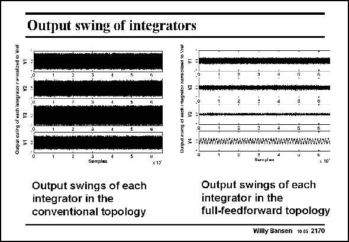

# SANSEN-2170 · Output swing of integrators

章节：21 低功耗 ΣΔ 模数转换器  
PDF 页：661；书本页：672；幻灯片编号：2170  
状态：unreviewed



## 对应教材讲解

### PDF 661 · 书本 672

This is also evidenced by investigating the signal levels at the outputs of the four integrators. In a conventional topology the signal swings are high at each output node. In a full-feedforward topology the signal swings are much smaller as they mainly contain the quantization errors. The distortion generated by these opamps will thererfore be a great deal smaller.

## 公式／性能结论候选摘录

以下为规则截取的原文，尚未逐项判读。

（未由规则找到；不代表原页没有此类内容。）

## 曲线结论候选摘录

以下为规则截取的原文，尚未逐项判读。

（未由规则找到；不代表原页没有此类内容。）

## 原文条件与近似候选摘录

以下为规则截取的原文，尚未逐项判读。

- PDF 661: In a full-feedforward topology the signal swings are much smaller as they mainly contain the quantization errors.

## 幻灯片 OCR（未校正）

```text
Output swing of integrators
o Bieet
samplat
Output swings of each
integrator in the
conventional topology
X15
-wwww
wwwwwwwwww.wwwwaw/wwowwwwwwos
Bumplace
Output swings of each
integrator in the
full-feedforward topology
Willy Sansen 10.05 2170
```

数学上下标、分数及正负号以原图为准。电路图已保留；未核对的连接不输出成可仿真 netlist。
