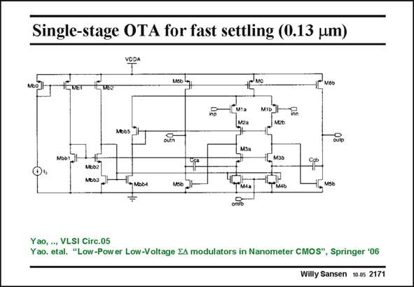

# SANSEN-2171 · Single-stage OTA for fast settling (0.13 um)

章节：21 低功耗 ΣΔ 模数转换器  
PDF 页：662；书本页：673；幻灯片编号：2171  
状态：unreviewed



## 对应教材讲解

### PDF 662 · 书本 673

The opamps used in fullfeedforward configuration can now have less gain; 30 dB is sufficient. The opamp schematic is shown in this slide. It is a conventional twostage opamp with a telescopic cascode at the input. The settling time has been optimized. A switchedcapacitor CMFB is used. The first one reaches a GBW of about 200 MHz and consumes 4 mA at 1 V. The load capacitor is now about 3 pF.

## 公式／性能结论候选摘录

以下为规则截取的原文，尚未逐项判读。

- PDF 662: The opamps used in fullfeedforward configuration can now have less gain; 30 dB is sufficient.

## 曲线结论候选摘录

以下为规则截取的原文，尚未逐项判读。

（未由规则找到；不代表原页没有此类内容。）

## 原文条件与近似候选摘录

以下为规则截取的原文，尚未逐项判读。

（未由规则找到；不代表原页没有此类内容。）

## 幻灯片 OCR（未校正）

```text
Single-stage OTA for fast settling (0.13 um)
MOb
cutp
- Mobe
MSo
Yao, .., VLSI Circ.05
Yao. etal. "Low-Power Low-Voltage EA modulators in Nanometer CMOS", Springer '06
Willy Sansen 10.05 2171
```

数学上下标、分数及正负号以原图为准。电路图已保留；未核对的连接不输出成可仿真 netlist。
