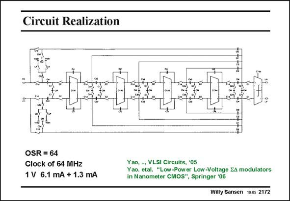

# SANSEN-2172 · Circuit Realization

章节：21 低功耗 ΣΔ 模数转换器  
PDF 页：662；书本页：673；幻灯片编号：2172  
状态：unreviewed



## 对应教材讲解

### PDF 662 · 书本 673

The circuit schematic of the 4th-order sigma delta converter is shown in this slide. The four stages are clearly seen. All switches are implemented as transmission gates. Since the threshold voltages are only about 0.35 V (in this 0.13 mm CMOS technology), there is no need for clock boosting circuitry. The capacitors are realized with sandwich structures using five layers. As a result, the capacitance is 0.35 fF/mm2. Clocked at 64 MHz, the modulator consumes 6.1 mA in the analog part and 1.3 mA in the digital part including the output buffer. The reference voltage is 0.8 V, with a supply voltage of 1 V. The oversampling ratio is 64, resulting in a 0.5 MHz maximum signal bandwidth.

## 公式／性能结论候选摘录

以下为规则截取的原文，尚未逐项判读。

- PDF 662: As a result, the capacitance is 0.35 fF/mm2.
- PDF 662: The oversampling ratio is 64, resulting in a 0.5 MHz maximum signal bandwidth.

## 曲线结论候选摘录

以下为规则截取的原文，尚未逐项判读。

（未由规则找到；不代表原页没有此类内容。）

## 原文条件与近似候选摘录

以下为规则截取的原文，尚未逐项判读。

（未由规则找到；不代表原页没有此类内容。）

## 幻灯片 OCR（未校正）

```text
Circuit Realization
OSR = 64
Clock of 64 MHz
1 V 6.1 mA + 1.3 mA
Y ao, .., VLSI Circuits, '05
Yao. etal. "Low-Power Low-Voltage EA modulators
in Nanometer CMOS", Springer '06
Willy Sansen 10.05 2172
```

数学上下标、分数及正负号以原图为准。电路图已保留；未核对的连接不输出成可仿真 netlist。
